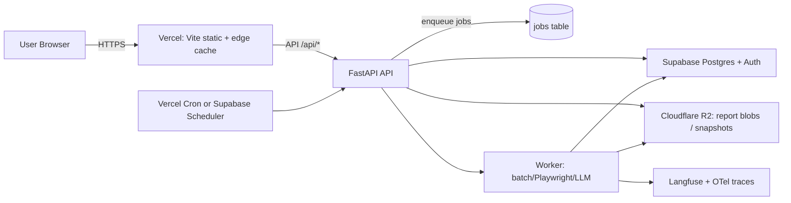
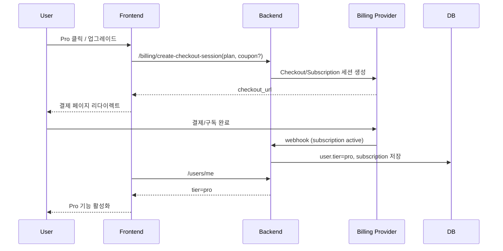

# SnapYourScope 글로벌 SEO·AEO SaaS 제품화 및 UI·코드 개선 제안서

## 수집 대상 데이터와 핵심 확인 과제

### 우선 수집할 데이터 목록
- entity["company","GitHub","code hosting company"] (HRDI0/SnapYourScope)
  - `/README.md` (제품/개발 개요)
  - `/frontend/index.html` (메인 랜딩)
  - `/frontend/app.html` + `/frontend/src/main.js` (대시보드/요금제/엔터프라이즈 탭)
  - `/frontend/keyword-rank.html` + `/frontend/src/keyword-rank.js`
  - `/frontend/prompt-tracker.html` + `/frontend/src/prompt-tracker.js`
  - `/frontend/aeo-optimizer.html` + `/frontend/src/aeo-optimizer.js`
  - `/frontend/src/landing.js` + `/frontend/src/landing.css` + `/frontend/src/tools.css`
  - `/api/main.py`, `/api/database.py`, `/api/models.py`
  - `/api/routes/*` (analyze, prompt_tracking, billing, aeo_optimizer, auth)
  - `/api/services/*` (analysis_service, sitemap_batch_service, search_tracking_service, llm_service 등)
  - `/seo_verifier.py`, `/aeo_verifier.py`

- 위 데이터는 로컬의 있는 데이터와 동일하거나 과거 데이터 이기 때문에 현재 로컬 데이터를 기반으로 개선 작업 진행하면 됨.

### 이번 작업에서 먼저 확정해야 할 정보
- “정밀 렌더링(Playwright)”을 **기본 제공**할지, **유료/제한형**으로 둘지(비용·타임아웃·운영 난이도 직결).
  - [결정] 비로그인은 경량 텍스트 기반, 로그인 사용자는 정밀 렌더링 포함으로 운영.
  - [반영 계획] 로그인 유도 UX 유지, 이메일 로그인 + 구글 소셜 로그인 우선 구현.
- 타깃 고객 1순위: **프리랜서/소기업** vs **에이전시** vs **B2B SaaS 마케팅 팀**(기능 우선순위·요금제·메시지 결정).
  - [결정] 1차 타깃은 프리랜서/소기업으로 고정, 이후 에이전시/B2B SaaS로 단계 확장.
- 매달 제공 가능한 “유료 크레딧” 기준치: 프롬프트 수/사이트맵 URL 수/검색 API 호출 수.
  - [결정] 현재 프로토타입에서는 크레딧 시스템 미적용.
  - [반영 계획] 유료화 2차 단계에서 크레딧 정책(프롬프트/사이트맵/API 호출) 도입.
- 결제·정산: **MoR(권장)**로 당장 갈지, 국내 PG+해외특약을 병행할지(수수료 vs 세무/리스크).
  - [결정] 당장 연동 가능한 결제 경로를 우선 선택하고, "연동만 하면 활성화" 가능한 코드 상태를 우선 구축.
- 데이터 보관 정책: 프롬프트 원문/LLM 응답을 **저장**할지(동의/마스킹) vs **요약만 저장**할지.
  - [결정] 현재 프로토타입에서는 프롬프트 원문/LLM 응답 미저장 정책 유지.
  - [반영 계획] GPT 공유 URL 우선, 타 LLM도 공유 URL 가능 시 동일 적용, 불가 시 요약 저장 방식 별도 설계.


## Executive Summary

SnapYourScope는 이미 “단일 URL 진단 → (키워드/프롬프트/추천) → 요금제 게이팅”까지 MVP의 뼈대가 구축되어 있습니다(대시보드·키워드 순위·프롬프트 추적·AEO 최적화·요금제/엔터프라이즈 폼·Stripe 체크아웃). 핵심은 **(1) 저비용 운영 가능한 분석 파이프라인으로 정렬**, **(2) 결제/정산의 현실적 우회(MoR 우선)**, **(3) 결과를 리포트 및 ‘수정 우선순위 작업 목록’으로 UX 재구성**, **(4) SnapYourScope 자체 사이트 SEO/AEO 신호(스키마/OG/콘텐츠 허브) 보강**입니다.

제품 포지셔닝은 “전통 SEO툴 대체”가 아니라 “AI 답변/AI 검색 가시성 운영(프롬프트 기반 브랜드 노출 + URL 기반 기술 신호)”로 좁히는 것이 승산이 큽니다. 실제로 entity["company","Semrush","seo software company"]는 AI Visibility Toolkit에서 AI 답변 내 브랜드 노출/프롬프트 추적/AI 크롤러 차단 이슈를 한 묶음으로 판매하며(월 $99), 업데이트 주기·프롬프트 한도까지 명시합니다. citeturn17search1 SnapYourScope는 이 영역을 **더 가볍고 저렴한 가격**으로 제공할 수 있는 구조입니다.

아키텍처는 “entity["company","Vercel","web hosting company"] + entity["company","Supabase","backend as a service company"] + entity["company","Cloudflare","internet infrastructure company"] R2”를 전제로, **분석을 2단계(경량/고비용)로 분리**해 운영비를 상수로 고정하는 전략이 필요합니다. 예: 기본은 HTTP+파싱 기반(무료/저렴), Playwright 렌더링·사이트맵 배치는 Pro/Enterprise에만 크레딧으로 제공.

결제는 한국 사업자가 entity["company","Stripe","payments company"]로 곧바로 “정산”까지 풀기 어려운 경우가 많으므로, 즉시 실행 가능한 경로는 **MoR(entity["company","Paddle","merchant of record company"])** 또는 **국내 PG+해외결제 특약(entity["company","PortOne","payments platform korea"] 등)**이며, 장기적으로 해외 법인 설립 후 Stripe로 회귀하는 로드맵이 합리적입니다. Paddle은 트랜잭션당 5%+50¢를 명시합니다. citeturn6search4

출처: GEO/GEO-bench(Generative Engine Optimization) 및 GEO-bench 데이터셋 카드 citeturn5search0turn5search3, Semrush AI Visibility Toolkit citeturn17search1, Paddle 가격 citeturn6search4

## 제품화 전략과 수익화 설계

SnapYourScope의 강점은 “기능이 많은 툴”이 아니라 **실무 워크플로우를 짧게 만드는 툴**입니다. 따라서 수익화는 (A) 베이스 구독, (B) 고비용 기능 크레딧/애드온, (C) 엔터프라이즈 운영/컨설팅의 3축이 가장 안정적입니다.

### 권장 요금제 구조
- Free  
  - 단일 URL 진단(경량 모드), 키워드 순위 1개, 경쟁사 1개, “샘플 결과 + 실행 체크리스트” 제공  
- Pro (월 $49 유지, 연간 -17%~2개월 무료 수준 권장)  
  - 사이트맵 배치(주간 갱신), 프롬프트 추적(기본 30개 포함), 경쟁사 URL 확장, 내보내기/공유(링크/CSV)  
- Enterprise (Custom)  
  - 조직별 정책(프롬프트 세트/카테고리/업데이트 SLA), 공급자(LLM/검색 API) 신뢰성 제어, 다계정/권한, 온보딩

### 애드온 설계(현재 코드 정책을 “과금 단위”로 고도화)
- 프롬프트 애드온: “기본 30개 + 5개당 $10”은 경쟁사 대비 **이해가 쉬운 과금 단위**입니다(이미 프론트 정책 상수로 존재).  
- 경쟁사 애드온: 경쟁사 URL은 “유료계정에 경우 기본 5개 + 초과 1개당 $10”처럼 “대시보드 비교 깊이”에 직접 연결되는 과금이 직관적입니다.
- 고비용 “렌더링/지역별 측정/GEO 멀티리전”: Pro에는 월 N회, 초과는 크레딧 차감(추가 결제)으로 분리(운영비 상수화).
- 모든 추가비용은 월간 결제에 합산되어 매월 결제.

출처: Semrush AI Visibility Toolkit의 프롬프트 추적·사이트 감사·업데이트 정책 citeturn17search1

## 저비용 아키텍처와 프롬프트 추적 운영 설계

### 저비용 아키텍처 원칙
- “고정비(플랫폼 기본료)”를 최소화하고, “변동비(LLM/검색 API/크롤링)”를 **크레딧·큐·레이트리밋**으로 제어.
- 저장은 DB(Supabase Postgres)에는 **인덱싱 가능한 요약/메타데이터**, 원문/대형 JSON은 R2에 저장(비용·성능 모두 유리).
- 관측가능성(LLM/배치)은 entity["company","Langfuse","llm observability company"] + entity["organization","OpenTelemetry","observability project"]로 “실패 원인·비용·지연”을 먼저 잡아야 애드온 과금이 정당화됩니다. Langfuse는 트레이싱/평가/프롬프트 버전 관리를 핵심 기능으로 명시합니다. citeturn9search4turn9search10

### 권장 구성도

citeturn6search2turn6search7turn18search0turn9search4turn9search0

- Vercel Pro는 플랫폼 fee $20/월과 월 $20 크레딧 구조를 명시합니다. citeturn6search0turn6search2  
- Supabase는 Pro 플랜($25) + 프로젝트별 컴퓨트 과금 구조(예시 포함)를 문서에서 설명합니다. citeturn6search7  
- Cloudflare R2는 10GB-month 무료, egress 무료, 저장/요청 단가를 문서로 제공합니다. citeturn18search0  
- OpenTelemetry JS는 TraceIdRatioBasedSampler 및 환경변수로 샘플링 비율 제어를 문서화합니다(관측 비용 통제에 필수). citeturn9search0

### “경량 분석”과 “고비용 분석” 분리(운영비 절감 핵심)
- 경량(Free/기본): HTML fetch + BeautifulSoup 기반 SEO/AEO 체크(현재 seo_verifier/aeo_verifier 구조를 유지하되 Playwright 의존 minimization).
- 고비용(Pro+): Playwright 렌더링(동적 사이트), 사이트맵 배치, LLM 기반 추천/프롬프트 추적.

### 프롬프트 추적 스키마 제안(현재 PromptTrackRun 확장)
| 테이블 | 필드 | 타입(권장) | 설명 | 인덱스/비고 |
|---|---|---|---|---|
| prompt_runs | id | bigint | 실행 ID | PK |
|  | user_id | uuid/int | 사용자 | (user_id, created_at) |
|  | target_url | text | 대상 URL | (target_url) |
|  | prompt_text | text | 프롬프트 원문 | **옵트인 저장** 권장 |
|  | prompt_hash | text | 원문 미저장 시 해시 | 중복 제거 |
|  | provider | text | gpt/gemini/perplexity 등 | (provider, created_at) |
|  | model | text | 모델/버전 |  |
|  | response_excerpt | text | 응답 일부(예: 1,500자) | PII 마스킹 |
|  | mention_tier | text | not_mentioned/mentioned/... | (mention_tier) |
|  | score | int | 티어 점수 |  |
|  | share_of_model_score | int | 평균 점수 | 대시보드 KPI |
|  | search_rank_json | jsonb | 엔진별 순위 | jsonb index optional |
|  | latency_ms | int | 지연 | 성능 분석 |
|  | cost_usd_est | numeric | 비용 추정(선택) | 과금 근거 |
|  | created_at | timestamptz | 생성 시각 | 파티셔닝 고려 |

#### 비용 효율적 검색/분석 스택
- “유사 프롬프트/클러스터링/재사용”이 필요하면 Postgres 벡터 확장(예: pgvector)로 DB 내부에서 해결 가능(별도 벡터 DB 비용 절감). citeturn8search0  
- 또는 entity["company","Qdrant","vector database company"]는 1GB 무료 클러스터를 제공하고(무카드), 프리티어의 리소스/중단 정책까지 문서화합니다. citeturn9search1turn9search3  

출처: Langfuse 기능/배포 citeturn9search4turn9search10, OpenTelemetry 샘플링 citeturn9search0, R2 가격 citeturn18search0, Qdrant 가격/프리티어 citeturn9search1turn9search3, pgvector citeturn8search0

## 경쟁사 벤치마킹과 MVP 기능 우선순위

### 경쟁사 벤치마킹 요약 표
| 서비스 | 가격대(월) | 타깃 | 강점 | 약점/기회 |
|---|---:|---|---|---|
| entity["company","Ahrefs","seo software company"] | £99~ | SEO 전문가/팀 | Site Audit/Rank Tracker/대규모 데이터, 크레딧 구조 | AEO “실행 워크플로우”는 상대적으로 분산(기회) citeturn16search0 |
| Semrush | $139.95~ + AI Toolkit $99 | 마케터/에이전시 | AI Visibility(브랜드/프롬프트/AI 사이트 감사) 패키징이 강함 | 가격·학습비용 높음 → “가벼운 대안” 기회 citeturn17search5turn17search1 |
| entity["company","Moz","seo software company"] | $49~ | SEO 초중급/프로 | 사용성/기본 SEO 기능 | AI 가시성 운영 “전용 워크플로우”는 약함(기회) citeturn11news36 |
| entity["company","Ubersuggest","seo tool by neil patel"] | 월간+라이프타임 | 예산형/초보 | 7일 트라이얼, 라이프타임(50년) 등 가격 정책 다양 | 엔터프라이즈급 신뢰·깊이 한계 citeturn10search3turn10search4 |
| entity["company","Similarweb","digital intelligence company"] | $125~ | 디지털 인텔리전스 | 트래픽/채널/인사이트 강점 | SEO/AEO 실무 실행까지는 거리 citeturn10search1 |
| entity["company","Serpstat","seo platform company"] | $50~ | 예산형/에이전시 | 키워드/감사/랭크/링크 기본 패키지 | AEO/프롬프트 기반 기능은 차별화 여지 citeturn10search0 |
| entity["company","Mangools","seo tools suite company"] | (시장가) $29.9~ | 예산형 | 올인원 미니 툴세트 | AI 가시성/프롬프트 운영은 공백 citeturn11search3turn11search0 |

### SnapYourScope 핵심 기능 우선순위 표
(팀 2명/저비용 기준, 월 운영비는 “플랫폼 고정비 + 변동비” 관점의 대략치)

| 우선 | 기능 | 저비용 MVP 정의 | 난이도 | 필요 인프라 | 월 운영비(대략) | 수익화 |
|---|---|---|---|---|---|---|
| 상 | 단일 URL SEO/AEO 진단 대시보드 | HTTP fetch 기반 진단 + 이슈 Top 10 + “수정 우선순위” | 중 | Vercel, Supabase(DB), R2(리포트) | $0~(저트래픽) + DB | 무료 진입 → Pro 업셀 |
| 상 | 결제-게이팅(Free/Pro/Ent) | 티어/크레딧 차감/업그레이드 CTA 일관화 | 중 | DB, 결제(아래 섹션) | 결제 수수료 | 구독 |
| 상 | 프롬프트 기반 브랜드 노출 추적 | 프롬프트 세트 저장 + 일일/주간 실행 + 티어 점수/추세 차트 | 높음 | DB, LLM API, Langfuse(선택) | LLM 변동비 ↑ | Pro+애드온(5개=$10) |
| 중 | 키워드 순위 추적 | 1키워드 무료, 배치 유료(현재 정책 유지) | 중 | 검색 API 키(구글/빙/네이버) | API 호출량에 비례 | 제한적 무료+유료 |
| 중 | 사이트맵 배치 분석 | job 테이블 + 크론 워커로 N개씩 처리 | 높음 | 워커, 큐(DB), R2 | 워커/렌더링 비용 | Pro/Enterprise |
| 중 | 경쟁사 비교(스냅샷) | 경쟁사 URL별 점수/이슈 비교(표+차트) | 중 | DB, R2 | 낮음 | 경쟁사 애드온 |
| 하 | 리포트 공유/내보내기 | 퍼블릭 링크(만료), PDF/CSV | 중 | R2, 서명 URL | 낮음 | Pro 기능 |
| 하 | 알림(이슈/랭크 변화) | 주간 이메일/슬랙 알림(선택) | 중 | 크론+메일 | 낮음 | Pro/Ent |

출처: 경쟁사 가격/기능(공식·준공식) citeturn16search0turn17search5turn17search1turn10search1turn10search0turn11news36turn10search3, Vercel Pro citeturn6search2, Supabase 과금 구조 citeturn6search7, R2 가격 citeturn18search0

## 결제·정산 옵션과 권장 플로우

### 옵션 비교 표
| 옵션 | 장점 | 단점/리스크 | 비용/수수료 근거 | 권장 상황 |
|---|---|---|---|---|
| MoR(entity["company","Paddle","merchant of record company"]) | 세금/결제/환불/차지백 책임을 MoR이 부담(운영 단순) | 수수료가 높아질 수 있음, 결제 정책에 종속 | 5% + $0.50/checkout citeturn6search4turn12search5 | **지금 당장 글로벌 구독 판매**(법인/세무 여력 부족) |
| entity["company","PayPal","online payments company"] | 시작 빠름, 광범위 커버리지 | 세금/VAT는 판매자가 처리, 분쟁/환불 운영 부담 | 상업 거래 수취 수수료 표 제공 citeturn7search3 | “결제 우회로”/초기 실험 |
| 국내 PG+해외특약(PortOne/Payletter 등) | KRW/국내 친화, 일부 해외카드 가능 | 계약/심사/수수료 높고 최소 조건 존재 가능 | 해외카드 수수료(예: 4.8% + 0.5% 등) citeturn12search3turn12search0 | 한국 고객 비중 큼, KRW 우선 |
| Stripe via 해외 법인 | 결제 UX/개발 생태계 강함 | 법인·세무·은행·운영 오버헤드 | Atlas $500 + 연 $100(2년차~) citeturn19search6 | 장기적 스케일/마진 최적화 |

보완 정보:
- Stripe는 한국 고객 대상으로 로컬 결제수단을 제공할 수 있으나, 결제수단별 “지원 사업자 소재지” 조건이 있으며(예: KR 카드 결제 지원 사업자 위치 목록에 한국이 없음), 구현·정산 현실상 해외 법인/해외 계정이 필요해질 수 있습니다. citeturn14search0turn14search3  
- entity["company","Mercury","us fintech bank"]는 “미국 설립 법인”이 필요하다고 명시합니다(계정 개설 자격). citeturn19search7turn19search1  

### 권장 결제 플로우

citeturn6search4turn19search6turn7search3

출처: Paddle 가격/모델 citeturn6search4turn12search5, PayPal 수수료 citeturn7search3, PortOne 해외결제 수수료 예시 citeturn12search3, Stripe Atlas/ Mercury citeturn19search6turn19search7, Stripe 한국 결제수단 문서 citeturn14search0turn14search3

## SEO/AEO 진단과 페이지별 UX·디자인 개선안

### 사이트별 진단 요약
- 메인(랜딩): 메타 description은 있으나, **Open Graph/트위터 카드/캐노니컬/조직·제품 스키마**가 부족합니다(검색·공유·AEO 인용 신호 약화). 또한 “Open Dashboard” 중심 CTA는 좋지만, **첫 화면에서 URL을 바로 넣고 ‘샘플 결과/이슈’까지 보게 하는 흐름**이 더 전환에 유리합니다.
- 앱/대시보드: 입력 폼은 존재하나 결과가 “JSON 출력” 성격이 강해 **실행 우선순위(What to fix first)**가 UI로 드러나지 않습니다.
- 키워드/프롬프트/AEO 페이지: 현재는 단일 실행 + 결과 출력 중심이라, “히스토리/비교/세그먼트(모델·엔진·기간)” UX가 부족합니다.

### 최우선 UI 목표
“보는 대시보드” → “고치는 대시보드”로 전환:  
- Top Issues를 **(시간 대비 효과)** 순으로 정렬  
- 각 이슈에 “수정 가이드(코드 예시/체크리스트) + 예상 효과(검색/AI 인용 가능성)”를 붙여 “다음 행동”을 강제

### 페이지별 와이어프레임 제안
```mermaid
flowchart TB
  subgraph Landing
    L1[Hero: URL 입력 + Analyze] --> L2[샘플 리포트(3개 이슈)]
    L2 --> L3[Prompt Visibility 미리보기]
    L3 --> L4[Pricing + FAQ]
  end
  subgraph Dashboard
    D1[KPI Ribbon: SEO/AEO/GEO/AI score] --> D2[Issues Board: P0/P1/P2]
    D2 --> D3[Compare: competitor table]
    D3 --> D4[Export/Share + Next actions]
  end
```

### 코드 수준 개선 지침(바닐라 JS + Vite 유지 전제)
핵심은 “중복 제거(언어/컴포넌트) + 결과 렌더링 표준화 + 접근성/반응형 강화”입니다.

#### 디자인 토큰/컴포넌트화
- `/frontend/src/core/tokens.css` 신설: 색상/타이포/스페이싱/라운드/쉐도우/포커스 링을 CSS 변수로 정의.
- 모든 페이지 CSS에서 `var(--token)`만 사용하도록 치환(다크모드도 토큰만 교체).
- 버튼/입력/카드/배지/알림 컴포넌트를 `frontend/src/ui/components.js`로 생성해 페이지마다 DOM 생성 로직 재사용.

**예시(토큰)**
```css
:root{
  --bg: #f6f8fb;
  --surface: #ffffff;
  --text: #0f172a;
  --muted: #64748b;
  --primary: #1f4ed8;
  --border: #e2e8f0;
  --radius: 14px;
  --focus: 0 0 0 3px rgba(31,78,216,.25);
}
:focus-visible{ outline: none; box-shadow: var(--focus); }
```

#### i18n 중복 제거
현재 각 페이지가 I18N 객체/함수를 중복으로 가지고 있습니다.  
- `/frontend/src/core/i18n.js`로 통합: `t(key)` / `setLang(lang)` / `bindTextMap(map)` 제공.
- 번역 키는 `common.* / nav.* / page.prompt.*`처럼 네임스페이스화해 확장.

#### 결과 렌더링 개선(“JSON 출력” 제거)
- 공통 렌더러: `/frontend/src/ui/renderers.js`
  - `renderScoreCards(container, data)`
  - `renderIssueList(container, issues)` (P0/P1/P2, 예상 난이도, 예상 효과)
  - `renderComparisonTable(container, self, competitors)`
- 서버 응답을 UI 친화적으로 바꾸기:  
  - `issues: [{id, title, why, fix_steps, impact_estimate, refs}]` 형태를 표준화.

#### SEO/AEO(자사 사이트) 우선 개선안
- 메타/OG/캐노니컬: index.html/app.html 등 모든 페이지 head에 추가.
- 구조화 데이터(JSON-LD): Organization + SoftwareApplication + FAQPage(요금제 FAQ).
- URL 설계: `/app`(대시보드), `/pricing`, `/docs`, `/blog`로 정적 라우팅(검색엔진 크롤링/내부링크 강화).
- 콘텐츠 전략: “AI Visibility/Prompt tracking/GEO 체크리스트”를 블로그/문서로 쌓아 AEO 인용 신호 강화. (GEO는 생성형 엔진에서 가시성을 향상시킬 수 있음을 주장하며, 벤치마크 데이터셋을 제공합니다.) citeturn5search3turn5search0

출처: GEO/GEO-bench citeturn5search3turn5search0

## 실행 로드맵, 개발 에이전트 지시 프롬프트, 해커톤 홍보 패키지

### 사용자가 해야 할 단계별 작업
1) 결제 결정: Paddle(MoR) vs PayPal vs 국내 PG 병행(전략 확정) citeturn6search4turn7search3turn12search3turn12search5  
2) DB 전환: SQLite → Supabase(Postgres) (models 기반 마이그레이션 스크립트 작성) citeturn6search7  
3) 분석 파이프라인 분리: “경량 기본” + “고비용(Pro 크레딧)”로 기능 스위치 도입  
4) R2 저장소 도입: 대형 리포트/원문은 R2 업로드, DB에는 메타+URL만 저장 citeturn18search0  
5) UI 리팩터: tokens/i18n/renderer 공통화 → 대시보드 결과를 “우선순위 작업 목록”으로 전환  
6) 관측: Langfuse+OTel로 프롬프트/배치 트레이싱, 샘플링 비율 설정(비용 제어) citeturn9search4turn9search0  
7) SEO/AEO: 구조화 데이터/OG/FAQ/문서 허브 추가(검색·AI 인용 대비) citeturn5search3  

### ohmyopencode에 지시할 “단계별 개발 프롬프트” 예시
- 프롬프트 A(디자인 시스템)
  - “`frontend/src/core/tokens.css` 생성, 기존 CSS를 토큰 기반으로 치환. 버튼/입력/카드 공통 컴포넌트(`frontend/src/ui/components.js`) 추가. Lighthouse 접근성(포커스 링/label 연결) 기준 통과.”
- 프롬프트 B(대시보드 결과 UX)
  - “`/api/analyze` 응답을 `issues[]` 표준으로 변환(why/fix_steps/impact). `frontend/src/ui/renderers.js`로 P0/P1/P2 이슈 보드 렌더링. 기존 JSON pre 출력 제거.”
- 프롬프트 C(사이트맵 배치 큐)
  - “Supabase에 `jobs` 테이블 설계, 워커는 크론으로 1분마다 N개 처리. Playwright는 Pro 크레딧 소진 시에만 실행. 실패 재시도/백오프 포함.”
- 프롬프트 D(결제 추상화)
  - “billing provider 인터페이스 추가(Stripe/Paddle/PayPal). DB에 provider 컬럼 반영. Checkout 생성/웹훅 처리 분리. 쿠폰/트라이얼 정책을 단일 정책 파일로 관리.”

### 해커톤 홍보 자료
- 상세 소개(피치 본문)
  - “SnapYourScope는 URL 하나로 기술 SEO·AEO 신호·AI 답변 내 브랜드 노출을 한 화면에서 보여주는 ‘가시성 운영 플랫폼’입니다. 팀이 가장 자주 겪는 문제(무엇부터 고칠지 모름, AI 답변에서 브랜드가 사라짐, 경쟁사 대비 위치가 불명확함)를 ‘점수+이슈 우선순위+비교’로 바로 행동하게 만듭니다.”
- 고객 문제/해결
  - 문제: SEO 지표는 많은데 실행 우선순위가 없다 → 해결: P0/P1/P2 이슈 보드 + 수정 가이드
  - 문제: AI 답변/프롬프트에서 브랜드 노출을 측정하기 어렵다 → 해결: 프롬프트 세트 기반 티어 점수 + 추세
  - 문제: 경쟁사와 비교가 느리다 → 해결: URL 스냅샷 비교 + 차이 요약
- 비즈니스 모델 캔버스(요약)
  - 고객: 소규모 SaaS/마케팅팀/에이전시
  - 가치제안: SEO+AEO “실행 우선순위”와 “AI 가시성 점수화”
  - 채널: 검색(콘텐츠), 커뮤니티, 파트너(에이전시)
  - 수익: 구독(월/연) + 애드온(프롬프트/경쟁사/렌더링 크레딧) + 엔터프라이즈
  - 비용: DB/스토리지/검색 API/LLM 변동비(크레딧으로 제어)
  - 핵심지표: 활성 URL 분석 수, Pro 전환률, 프롬프트 세트 유지율, CAC/LTV

출처: Vercel/Supabase/R2 비용 구조 citeturn6search2turn6search7turn18search0, Paddle MoR/가격 citeturn12search5turn6search4, PayPal 수수료 citeturn7search3, Langfuse/OTel citeturn9search4turn9search0

---

## 통합 개발 계획서 (Merged from DEVELOPMENT_PLAN.md)

본 섹션부터는 기존 `DEVELOPMENT_PLAN.md` 내용을 본 문서에 통합한 실행 계획입니다.
이 문서(`deep-research-report.md`)를 단일 기준 문서로 사용합니다.

### 1. 목표와 전제

- 목표
  - 5페이지 구조(메인/대시보드/키워드/프롬프트/AEO)를 유지하면서 UX를 하나의 제품처럼 통합
  - SEO/AEO 서비스 운영에 필요한 백엔드, 데이터, 배포, 결제 준비를 사전 완료
  - 외부 서비스 계정(Vercel/Supabase/R2/Stripe/API키)만 연결하면 운영 가능한 상태 달성
- 전제
  - 현재 코드베이스는 MVP 기능(분석, 게이팅, 추적, 추천, Stripe 기본)을 보유
  - 결제는 현재 Stripe 단일 경로로 유지(대체 결제수단은 계획만 유지)

### 2. 확정 결정사항 반영

- 정밀 렌더링 정책
  - 비로그인: 경량 텍스트 분석
  - 로그인: 정밀 렌더링 포함 분석
- 인증 정책
  - 이메일 로그인 + 구글 소셜 로그인 우선
- 타깃 정책
  - 1차 타깃은 프리랜서/소기업 고정
- 크레딧 정책
  - 현재 프로토타입은 크레딧 미적용, 2차 유료화에서 도입
- 결제 정책
  - 당장 연동 가능한 결제 경로 우선, "연동만 하면 활성화" 상태를 먼저 달성
- 데이터 저장 정책
  - 프롬프트 원문/LLM 응답 미저장 유지
  - 공유 URL 가능한 공급자는 URL 기반 접근 우선

### 3. 파트별 논의 및 합의안

#### 3.1 기획(PO/PM) 파트

- 논점
  - 사용자가 "무엇을 먼저 고쳐야 하는지"를 즉시 알 수 있어야 함
  - 무료/유료 경계를 학습 없이 이해 가능한 정책 문구로 고정
- 합의
  - 대시보드 중심 IA 유지, 결과 표현은 "이슈 우선순위 보드" 강화
  - 가격/제한 정책은 단일 정책 원천(코드 상수 + 문서 동기화)으로 운영

#### 3.2 백엔드 파트

- 논점
  - SQLite 기반 MVP를 운영형 데이터 구조로 확장 가능한 형태로 준비 필요
  - 배치/프롬프트 실행의 비용과 실패 복구 로직 표준화 필요
- 합의
  - DB 마이그레이션 경로(SQLite -> Postgres) 설계 문서화
  - 분석 작업(특히 배치)을 jobs/worker 패턴으로 명확히 분리
  - 스토리지 경로(리포트 blob 외부 저장) 인터페이스를 선구현

#### 3.3 프론트엔드 파트

- 논점
  - 페이지별 중복(i18n/session/tier/rendering) 감소가 유지보수 핵심
  - 대시보드형 시각 언어 일관화 필요
- 합의
  - 공통 shell, 공통 토큰, 공통 렌더러 패턴 적용 확대
  - 결과 UI를 JSON 출력 중심에서 카드/이슈/비교 중심으로 단계 전환

#### 3.4 AI 엔지니어링 파트

- 논점
  - 프롬프트 추적 품질과 비용 사이 밸런스 필요
  - provider fallback/신뢰성/로그 추적 정책 필요
- 합의
  - 프롬프트 세트 단위 실행 + 주간 갱신 기본 정책 유지
  - 모델/응답/점수 계산 파이프라인에 추적 메타(지연, 실패, 비용추정) 추가

#### 3.5 DevOps/데이터 파트

- 논점
  - 배포/스케줄러/스토리지/환경변수 관리를 계정 연동 직전 상태까지 준비
- 합의
  - IaC까지는 아니더라도 "환경 변수/서비스 연결 체크리스트"를 문서화
  - 스테이징/운영 분리 규칙과 릴리즈 점검표를 사전 고정

### 4. 단계별 실행 계획

#### Phase 0 - 기준선 고정 (1~2일)

- 기획: KPI 정의(활성 분석 수, 유료 전환률, 프롬프트 유지율)
- 백엔드: API 계약서(요청/응답) 동결 버전 작성
- 프론트: 핵심 화면 요소와 정책 문구 스냅샷 확정
- 산출물: API 계약 문서, 정책 표, 화면 기준서

#### Phase 1 - 디자인/UX 구조 보강 (3~5일)

- 프론트: 5페이지 공통 shell과 컴포넌트 규칙 확장, 이슈 우선순위 보드 설계
- 기획: 사용자 흐름(분석 -> 이슈 확인 -> 업그레이드/실행) 검증
- 산출물: 통합 UI 스펙, 컴포넌트 맵, 사용자 시나리오

#### Phase 2 - 백엔드/데이터 모델 준비 (4~6일)

- 백엔드: 요약 메타 vs 대형 원문 분리, jobs 기반 재시도 상태 모델 정의
- 데이터: Postgres 전환 스키마와 마이그레이션 리허설 스크립트 준비
- 산출물: DB migration plan, job state model, storage contract

#### Phase 3 - 스토리지/배포 준비 (3~4일)

- DevOps: 스토리지 업로드/조회 추상화, 배포 환경변수 템플릿 완성
- 백엔드: 로컬/원격 스토리지 전략 분리
- 산출물: `.env.example` 확장본, 배포 체크리스트, 스토리지 연결 체크 스크립트

#### Phase 4 - 결제 시스템 운영 준비 (2~3일)

- 백엔드: Stripe checkout/webhook/portal 운영 검증 루틴 정리
- 기획: 요금제 정책과 기능 게이팅 표 문구 고정
- 산출물: Billing runbook, webhook test checklist, pricing policy table

#### Phase 5 - AI 추적 운영 준비 (3~5일)

- AI 엔지니어링: 품질 기준(티어 점수/오탐 기준), 실패/재시도/비용 지표 정의
- 백엔드: 실행 로그 표준화(latency/error/provider/model)
- 산출물: AI 운영 가이드, 추적 지표 정의서

#### Phase 6 - 계정 연동 및 go-live 체크 (1~2일)

- 운영자가 연결할 항목
  - Stripe 키/가격 ID/웹훅 시크릿
  - 배포 프로젝트/도메인
  - DB/스토리지 접속 정보
  - 외부 API 키(OpenAI/Gemini/검색 API)
- 팀 제공 항목
  - 환경변수 표, 웹훅 테스트 절차, 롤백/장애 대응 절차

### 5. 계정 연동만 남기기 체크리스트

- [ ] `.env.example`에 필수 키와 설명 정의
- [ ] 결제 웹훅 검증 절차 문서화
- [ ] DB 전환/연결 단계 스크립트 또는 문서로 재현 가능
- [ ] 스토리지 실패 시 로컬 fallback 정의
- [ ] 배포 후 헬스체크(`/health`, 핵심 API smoke test) 자동/반자동 가능

### 6. 리스크와 대응

- 비용 리스크: 경량/고비용 분석 분리, 사용량 상한, 주기 실행
- 품질 리스크: 점수 규칙 고정 + 샘플 검증 세트 유지
- 결제 리스크: webhook idempotency + 이벤트 로그 + 재처리 절차
- 배포 리스크: 스테이징 선검증 + 롤백 가이드 고정

### 7. 완료 기준 (Definition of Done)

- 제품: 5페이지 UX 일관성 + 핵심 플로우 단절 없음
- 기술: 배포/DB/스토리지/결제 준비 상태가 문서+코드로 재현 가능
- 운영: 계정/키 연결만으로 서비스 활성화 가능
- 문서: `DEVELOPMENT_REPORT.md`, `IMPLEMENTATION_PROGRESS.md`, `README.md` 동기화
