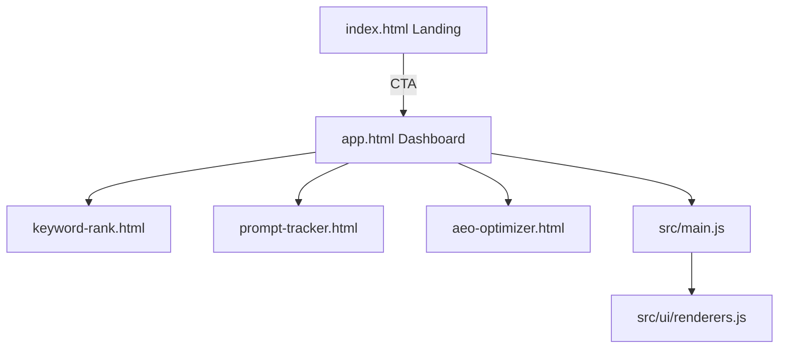
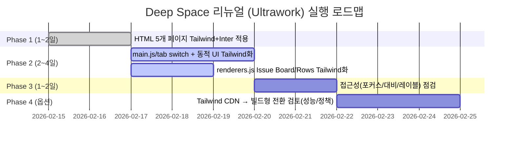

# SnapYourScope Frontend “Modern Dark AI SaaS (Deep Space)” 전면 리뉴얼 코드 패치 보고서

## Executive Summary
사용된 커넥터: **GitHub**(HRDI0/SnapYourScope).  
현재 `frontend/`는 **Vite 멀티 페이지** 구조(index/app/keyword-rank/prompt-tracker/aeo-optimizer)이며, 기존 UI는 `style.css`, `src/landing.css`, `src/tools.css`에 강하게 의존합니다(HTML `<link>` + JS `import`로 주입). 이를 **Tailwind CSS CDN + Inter**로 전환하고(모든 HTML), **Deep Space(슬레이트-950)** 기반의 Glassmorphism 카드/그라데이션 강조색(Violet~Fuchsia) 및 **Hover Scale+Glow**, **로드 시 Fade-in**을 포함하는 “Modern Dark AI SaaS” 테마로 재구성합니다. Tailwind “Play CDN”은 본래 프로토타이핑 목적이며 프로덕션 권장 방식은 아니라는 점은 리스크로 기록하되(요구사항상 CDN 사용), 구현은 요구에 맞춰 진행합니다. citeturn0search0turn0search3turn4search2



## 코드베이스 현황과 디자인 제약
`frontend/package.json` 기준으로 런타임 의존성은 `chart.js`, `lucide`, 개발은 `vite` 중심입니다. 즉, **CSS를 JS에서 import하는 Vite 방식**이 현재 기본이며, 이를 제거하면(요구사항) **Tailwind CDN이 UI의 유일한 스타일 소스**가 됩니다. 따라서 JS가 생성하는 HTML 문자열(`src/main.js`, `src/ui/renderers.js`)에 기존 클래스(`dashboard-card`, `badge-pass` 등)만 남으면 스타일이 사라지므로, **동적 렌더 HTML에도 Tailwind 유틸리티를 직접 삽입**해야 합니다.

핵심 디자인 훅(기능 유지 위해 유지 필요):
- `app.html` 탭 전환: `.tab-link`, `.tab-panel`(JS가 querySelector로 사용)
- 요금제 카드: `.plan-card[data-plan]`
- 랜딩 요금제 카드: `.landing-plan-card[data-plan]`
- 결과 `<pre>`: `data-state`를 JS가 갱신(샘플/에러/결과 표시)

## Deep Space 테마 설계 원칙
Deep Space에서 **가독성과 신뢰감**을 유지하려면 “어두운 배경에서 흰색/밝은 텍스트는 계층(Primary/Secondary/Disabled)별 투명도/명도 관리”가 중요합니다. Material Design은 어두운 배경에서 텍스트 중요도에 따라 흰색 텍스트의 권장 불투명도(Primary 100%, Secondary 70% 등)를 제시합니다. 이를 Tailwind의 `text-white`, `text-slate-200`, `text-slate-400` 계층으로 대응합니다. citeturn2search0turn2search1  
또한 WCAG의 최소 명도 대비(일반 텍스트 4.5:1, 큰 텍스트 3:1)를 만족하도록 카드/입력필드/본문 대비를 보수적으로 설정합니다. citeturn0search5turn0search2  
폼/입력 요소는 레이블 제공과 인접 배경 대비(테두리/채움 3:1 이상)를 명시한 KRDS 접근성 가이드를 반영해 `label`/`aria-label` 및 충분한 테두리 대비를 유지합니다. citeturn4search1  
키보드 사용자 신뢰를 위해 Focus Visible(초점 표시) 요구(WCAG 2.4.7)에 따라 `focus-visible:ring-*`를 모든 버튼/입력에 부여합니다. citeturn1search1  
애니메이션은 `motion-reduce:`로 완화/비활성화하여 사용자의 “Reduce motion” 설정을 존중합니다. citeturn1search3turn2search6  
Inter 폰트 로딩은 Google Fonts CSS2 API 규격(`css2?family=...&display=swap`)을 따릅니다. citeturn3search1turn4search0

## 적용 패치
아래는 **“파일 내용 전체 교체” 또는 “부분 치환”** 기준으로 제공됩니다. (요구사항: CSS 파일 의존 제거, Tailwind 유틸 적용, Inter 사용, Hover/Glow, Fade-in)

### 모든 HTML 공통 Head 스니펫
- 모든 `frontend/*.html`의 `<head>`에 아래 블록을 포함(기존 CSS `<link rel="stylesheet"...>` 제거)
- Tailwind CDN은 예시로 `cdn.tailwindcss.com` 사용(요구사항의 “CDN 추가” 충족). citeturn0search3turn4search2

```html
<!-- Inter (Google Fonts, CSS2 API) -->
<link rel="preconnect" href="https://fonts.googleapis.com" />
<link rel="preconnect" href="https://fonts.gstatic.com" crossorigin />
<link href="https://fonts.googleapis.com/css2?family=Inter:wght@400;500;600;700&display=swap" rel="stylesheet" />
<meta name="theme-color" content="#020617" />

<!-- Tailwind CDN -->
<script>
  tailwind.config = {
    theme: {
      extend: {
        fontFamily: { sans: ["Inter", "ui-sans-serif", "system-ui", "sans-serif"] },
        keyframes: {
          fadeUp: { "0%": { opacity: "0", transform: "translateY(10px)" }, "100%": { opacity: "1", transform: "translateY(0)" } },
        },
        animation: { "fade-in": "fadeUp 0.65s ease-out both" },
      },
    },
  };
</script>
<script src="https://cdn.tailwindcss.com"></script>
```

### frontend/index.html 전체 교체
```html
<!doctype html>
<html lang="en" class="scroll-smooth">
<head>
  <meta charset="UTF-8" />
  <meta name="viewport" content="width=device-width, initial-scale=1.0" />
  <title>SnapYourScope | SEO, AEO, GEO Intelligence</title>
  <meta name="description" content="SnapYourScope helps teams audit URL visibility across SEO, AEO, GEO, and search/LLM surfaces." />

  <!-- 공통 Head 스니펫 삽입 (Inter + Tailwind CDN) -->
  <link rel="preconnect" href="https://fonts.googleapis.com" />
  <link rel="preconnect" href="https://fonts.gstatic.com" crossorigin />
  <link href="https://fonts.googleapis.com/css2?family=Inter:wght@400;500;600;700&display=swap" rel="stylesheet" />
  <meta name="theme-color" content="#020617" />
  <script>
    tailwind.config = {
      theme: {
        extend: {
          fontFamily: { sans: ["Inter", "ui-sans-serif", "system-ui", "sans-serif"] },
          keyframes: { fadeUp: { "0%": { opacity: "0", transform: "translateY(10px)" }, "100%": { opacity: "1", transform: "translateY(0)" } } },
          animation: { "fade-in": "fadeUp 0.65s ease-out both" },
        },
      },
    };
  </script>
  <script src="https://cdn.tailwindcss.com"></script>
</head>

<body class="min-h-screen bg-slate-950 font-sans text-slate-200 antialiased">
  <!-- Deep Space Background -->
  <div aria-hidden="true" class="pointer-events-none fixed inset-0 -z-10 overflow-hidden">
    <div class="absolute inset-0 bg-slate-950"></div>
    <div class="absolute -top-72 left-1/2 h-[620px] w-[980px] -translate-x-1/2 rounded-full bg-gradient-to-r from-violet-500/25 to-fuchsia-500/25 blur-3xl"></div>
    <div class="absolute bottom-0 right-[-140px] h-[520px] w-[520px] rounded-full bg-gradient-to-tr from-cyan-400/10 to-violet-500/15 blur-3xl"></div>
    <div class="absolute inset-0 bg-[radial-gradient(circle_at_top,rgba(255,255,255,0.07),transparent_60%)]"></div>
  </div>

  <!-- Transparent Sticky Header -->
  <header class="sticky top-0 z-50 border-b border-slate-800/60 bg-slate-950/65 backdrop-blur-xl">
    <div class="mx-auto flex max-w-7xl items-center justify-between gap-3 px-4 py-3">
      <a href="/" class="flex items-center gap-3">
        <span class="flex h-9 w-9 items-center justify-center rounded-xl bg-gradient-to-r from-violet-500 to-fuchsia-500 text-sm font-extrabold text-white shadow-[0_0_0_1px_rgba(255,255,255,0.18),0_12px_35px_rgba(168,85,247,0.35)]">S</span>
        <div class="leading-tight">
          <p class="text-sm font-semibold text-white">SnapYourScope</p>
          <p id="landing-tagline" class="text-xs text-slate-400">Lightweight URL-based SEO/AEO intelligence</p>
        </div>
      </a>

      <div class="flex items-center gap-2">
        <nav class="hidden items-center gap-3 text-xs font-semibold text-slate-300 lg:flex">
          <a id="landing-nav-main" href="/" class="rounded-xl px-2 py-2 transition hover:text-white">Main</a>
          <a id="landing-nav-dashboard" href="/app.html" class="rounded-xl px-2 py-2 transition hover:text-white">Dashboard</a>
          <a id="landing-nav-keyword" href="/keyword-rank.html" class="rounded-xl px-2 py-2 transition hover:text-white">Keyword Rank</a>
          <a id="landing-nav-prompt" href="/prompt-tracker.html" class="rounded-xl px-2 py-2 transition hover:text-white">Prompt Tracker</a>
          <a id="landing-nav-optimizer" href="/aeo-optimizer.html" class="rounded-xl px-2 py-2 transition hover:text-white">SEO/AEO Optimizer</a>
          <a id="landing-nav-pricing" href="/app.html?tab=pricing" class="rounded-xl px-2 py-2 transition hover:text-white">Pricing</a>
          <a id="landing-nav-inquiry" href="/app.html?tab=enterprise" class="rounded-xl px-2 py-2 transition hover:text-white">Inquiry</a>
        </nav>

        <select id="language-select" aria-label="Language"
          class="rounded-xl border border-slate-700/60 bg-slate-950/60 px-3 py-2 text-xs font-semibold text-slate-200 outline-none transition focus-visible:ring-2 focus-visible:ring-violet-500/70 focus-visible:ring-offset-2 focus-visible:ring-offset-slate-950">
          <option value="en">EN</option>
          <option value="ko">KR</option>
          <option value="ja">JP</option>
          <option value="zh">CN</option>
        </select>

        <a href="/app.html"
          class="hidden sm:inline-flex items-center justify-center rounded-xl bg-gradient-to-r from-violet-500 to-fuchsia-500 px-4 py-2.5 text-sm font-semibold text-white shadow-[0_0_0_1px_rgba(255,255,255,0.18),0_16px_45px_rgba(168,85,247,0.35)] transition duration-200 ease-out hover:scale-[1.03] hover:shadow-[0_0_0_1px_rgba(255,255,255,0.22),0_22px_60px_rgba(168,85,247,0.45)] focus-visible:outline-none focus-visible:ring-2 focus-visible:ring-fuchsia-400/70 focus-visible:ring-offset-2 focus-visible:ring-offset-slate-950 motion-reduce:transition-none motion-reduce:hover:scale-100">
          Get Started
        </a>
      </div>
    </div>
  </header>

  <main class="mx-auto max-w-7xl px-4 py-14 motion-safe:animate-fade-in motion-reduce:animate-none">
    <!-- Hero -->
    <section class="grid gap-10 lg:grid-cols-12 lg:items-center">
      <div class="lg:col-span-7">
        <p id="landing-eyebrow" class="inline-flex items-center gap-2 text-xs font-semibold tracking-widest uppercase text-slate-400">
          <span class="h-2 w-2 rounded-full bg-gradient-to-r from-violet-500 to-fuchsia-500"></span>
          Visibility Operating System
        </p>

        <h1 id="landing-hero-title" class="mt-4 text-4xl font-extrabold tracking-tight text-white sm:text-5xl lg:text-6xl">
          <span class="bg-gradient-to-r from-violet-400 to-fuchsia-400 bg-clip-text text-transparent">Track your brand</span>
          in web search and AI answers from one workflow
        </h1>

        <p id="landing-hero-description" class="mt-5 max-w-2xl text-base text-slate-300">
          Built for teams that need practical SEO + AEO execution: quick URL audits, paid prompt tracking, and recommendation workflows.
        </p>

        <div class="mt-8 flex flex-wrap gap-3">
          <a id="landing-open-dashboard" href="/app.html"
            class="inline-flex items-center justify-center rounded-xl bg-gradient-to-r from-violet-500 to-fuchsia-500 px-5 py-3 text-sm font-semibold text-white shadow-[0_0_0_1px_rgba(255,255,255,0.18),0_16px_45px_rgba(168,85,247,0.35)] transition duration-200 ease-out hover:scale-[1.03] hover:shadow-[0_0_0_1px_rgba(255,255,255,0.22),0_22px_60px_rgba(168,85,247,0.45)] focus-visible:outline-none focus-visible:ring-2 focus-visible:ring-fuchsia-400/70 focus-visible:ring-offset-2 focus-visible:ring-offset-slate-950 motion-reduce:transition-none motion-reduce:hover:scale-100">
            Open Dashboard
          </a>

          <a id="landing-open-keyword" href="/keyword-rank.html"
            class="inline-flex items-center justify-center rounded-xl border border-slate-700/60 bg-slate-900/35 px-5 py-3 text-sm font-semibold text-slate-200 transition duration-200 ease-out hover:scale-[1.03] hover:border-slate-600/70 hover:bg-slate-900/55 hover:text-white hover:shadow-[0_0_0_1px_rgba(168,85,247,0.18),0_16px_45px_rgba(0,0,0,0.55)] focus-visible:outline-none focus-visible:ring-2 focus-visible:ring-violet-400/70 focus-visible:ring-offset-2 focus-visible:ring-offset-slate-950 motion-reduce:transition-none motion-reduce:hover:scale-100">
            Open Keyword Rank
          </a>

          <a id="landing-try-prompt" href="/prompt-tracker.html"
            class="inline-flex items-center justify-center rounded-xl border border-slate-700/60 bg-slate-900/35 px-5 py-3 text-sm font-semibold text-slate-200 transition duration-200 ease-out hover:scale-[1.03] hover:border-slate-600/70 hover:bg-slate-900/55 hover:text-white hover:shadow-[0_0_0_1px_rgba(168,85,247,0.18),0_16px_45px_rgba(0,0,0,0.55)] focus-visible:outline-none focus-visible:ring-2 focus-visible:ring-violet-400/70 focus-visible:ring-offset-2 focus-visible:ring-offset-slate-950 motion-reduce:transition-none motion-reduce:hover:scale-100">
            Try Prompt Tracker
          </a>
        </div>

        <p class="mt-6 text-xs text-slate-500">
          Deep Space UI: glass cards + violet/fuchsia gradient accents + accessible focus rings.
        </p>
      </div>

      <!-- Hero Card -->
      <article class="lg:col-span-5">
        <div class="group rounded-2xl border border-slate-800/60 bg-slate-900/55 p-6 backdrop-blur-xl shadow-[0_0_0_1px_rgba(255,255,255,0.05),0_20px_60px_rgba(0,0,0,0.55)] transition duration-200 ease-out hover:scale-[1.01] hover:border-violet-500/25 hover:shadow-[0_0_0_1px_rgba(168,85,247,0.35),0_30px_90px_rgba(0,0,0,0.65)] motion-reduce:transition-none motion-reduce:hover:scale-100">
          <div class="flex items-start justify-between gap-4">
            <h2 id="landing-what-now" class="text-lg font-bold text-white">What you can run now</h2>
            <span class="inline-flex items-center rounded-full border border-violet-500/25 bg-violet-500/10 px-2.5 py-1 text-xs font-semibold text-violet-200">Ready</span>
          </div>
          <ul class="mt-4 space-y-3 text-sm text-slate-300">
            <li id="landing-li-1" class="flex gap-2"><span class="mt-1 h-1.5 w-1.5 rounded-full bg-fuchsia-400"></span>Single URL SEO/AEO/GEO analysis</li>
            <li id="landing-li-2" class="flex gap-2"><span class="mt-1 h-1.5 w-1.5 rounded-full bg-fuchsia-400"></span>Free web search rank tracking (Google/Bing/Naver)</li>
            <li id="landing-li-3" class="flex gap-2"><span class="mt-1 h-1.5 w-1.5 rounded-full bg-fuchsia-400"></span>Paid prompt tracking with share-of-model scoring</li>
            <li id="landing-li-4" class="flex gap-2"><span class="mt-1 h-1.5 w-1.5 rounded-full bg-fuchsia-400"></span>Paid SEO/AEO optimization recommendations</li>
          </ul>
        </div>
      </article>
    </section>

    <!-- Features (Bento Grid) -->
    <section class="mt-16">
      <div class="flex items-end justify-between gap-4">
        <h2 class="text-xl font-bold text-white">Features</h2>
        <p class="text-xs text-slate-500">Bento-style layout for scannability.</p>
      </div>

      <div class="mt-6 grid grid-cols-1 gap-4 md:grid-cols-2 lg:grid-cols-3">
        <article class="group rounded-2xl border border-slate-800/60 bg-slate-900/55 p-6 backdrop-blur-xl shadow-[0_0_0_1px_rgba(255,255,255,0.05),0_18px_55px_rgba(0,0,0,0.55)] transition duration-200 hover:scale-[1.01] hover:border-violet-500/25 hover:shadow-[0_0_0_1px_rgba(168,85,247,0.35),0_28px_80px_rgba(0,0,0,0.65)] lg:col-span-2 motion-reduce:hover:scale-100">
          <h3 id="landing-feature-1-title" class="text-lg font-bold text-white">SEO & AEO Dashboard</h3>
          <p id="landing-feature-1-desc" class="mt-2 text-sm text-slate-300">Analyze technical and answer-engine signals with chart-based diagnostics.</p>
          <div class="mt-4 inline-flex items-center gap-2 text-xs font-semibold text-slate-400">
            <span class="h-2 w-2 rounded-full bg-gradient-to-r from-violet-500 to-fuchsia-500"></span> KPI ribbon · Charts · Fix queue
          </div>
        </article>

        <article class="group rounded-2xl border border-slate-800/60 bg-slate-900/55 p-6 backdrop-blur-xl shadow-[0_0_0_1px_rgba(255,255,255,0.05),0_18px_55px_rgba(0,0,0,0.55)] transition duration-200 hover:scale-[1.01] hover:border-violet-500/25 hover:shadow-[0_0_0_1px_rgba(168,85,247,0.35),0_28px_80px_rgba(0,0,0,0.65)] motion-reduce:hover:scale-100">
          <h3 id="landing-feature-2-title" class="text-lg font-bold text-white">Prompt Tracking</h3>
          <p id="landing-feature-2-desc" class="mt-2 text-sm text-slate-300">Score brand visibility by tier: not mentioned, mentioned, linked, core mention.</p>
        </article>

        <article class="group rounded-2xl border border-slate-800/60 bg-slate-900/55 p-6 backdrop-blur-xl shadow-[0_0_0_1px_rgba(255,255,255,0.05),0_18px_55px_rgba(0,0,0,0.55)] transition duration-200 hover:scale-[1.01] hover:border-violet-500/25 hover:shadow-[0_0_0_1px_rgba(168,85,247,0.35),0_28px_80px_rgba(0,0,0,0.65)] motion-reduce:hover:scale-100">
          <h3 id="landing-feature-3-title" class="text-lg font-bold text-white">Search Rank Monitor</h3>
          <p id="landing-feature-3-desc" class="mt-2 text-sm text-slate-300">Check the position where your brand URL appears in web search results.</p>
        </article>

        <article class="group rounded-2xl border border-slate-800/60 bg-slate-900/55 p-6 backdrop-blur-xl shadow-[0_0_0_1px_rgba(255,255,255,0.05),0_18px_55px_rgba(0,0,0,0.55)] transition duration-200 hover:scale-[1.01] hover:border-violet-500/25 hover:shadow-[0_0_0_1px_rgba(168,85,247,0.35),0_28px_80px_rgba(0,0,0,0.65)] motion-reduce:hover:scale-100">
          <h3 id="landing-feature-4-title" class="text-lg font-bold text-white">SEO/AEO Optimizer</h3>
          <p id="landing-feature-4-desc" class="mt-2 text-sm text-slate-300">Generate practical recommendations based on URL audit outputs and SEO/AEO principles.</p>
        </article>
      </div>
    </section>

    <!-- Plans -->
    <section class="mt-16">
      <div class="flex items-end justify-between gap-4">
        <h2 id="landing-plans-title" class="text-xl font-bold text-white">Plans</h2>
        <p class="text-xs text-slate-500">Click to proceed (Pro/Enterprise).</p>
      </div>

      <div class="mt-6 grid grid-cols-1 gap-4 lg:grid-cols-3">
        <article class="landing-plan-card group rounded-2xl border border-slate-800/60 bg-slate-900/55 p-6 backdrop-blur-xl shadow-[0_0_0_1px_rgba(255,255,255,0.05),0_18px_55px_rgba(0,0,0,0.55)] transition duration-200 hover:scale-[1.01] hover:border-slate-600/70 hover:shadow-[0_0_0_1px_rgba(255,255,255,0.08),0_28px_80px_rgba(0,0,0,0.65)] motion-reduce:hover:scale-100" data-plan="free">
          <h3 id="landing-plan-free-title" class="text-lg font-bold text-white">Free</h3>
          <p class="mt-2 text-3xl font-extrabold text-white">$0</p>
          <ul class="mt-4 list-disc space-y-2 pl-5 text-sm text-slate-300">
            <li id="landing-plan-free-f1">Single URL dashboard audit</li>
            <li id="landing-plan-free-f2">Search rank tracking (API-key based)</li>
          </ul>
        </article>

        <article class="landing-plan-card group cursor-pointer rounded-2xl border border-violet-500/20 bg-slate-900/55 p-6 backdrop-blur-xl shadow-[0_0_0_1px_rgba(168,85,247,0.20),0_18px_55px_rgba(0,0,0,0.55)] transition duration-200 hover:scale-[1.02] hover:border-violet-500/35 hover:shadow-[0_0_0_1px_rgba(168,85,247,0.35),0_34px_90px_rgba(0,0,0,0.70)] motion-reduce:hover:scale-100" data-plan="pro">
          <div class="flex items-center justify-between gap-3">
            <h3 id="landing-plan-pro-title" class="text-lg font-bold text-white">Pro</h3>
            <span class="rounded-full bg-gradient-to-r from-violet-500 to-fuchsia-500 px-2.5 py-1 text-xs font-semibold text-white">Popular</span>
          </div>
          <p class="mt-2 text-3xl font-extrabold text-white">$49<span class="text-sm font-semibold text-slate-400">/mo</span></p>
          <ul class="mt-4 list-disc space-y-2 pl-5 text-sm text-slate-300">
            <li id="landing-plan-pro-f1">Sitemap batch analysis</li>
            <li id="landing-plan-pro-f2">Prompt tracking and scoring</li>
            <li id="landing-plan-pro-f3">AEO optimization recommendations</li>
          </ul>
        </article>

        <article class="landing-plan-card group cursor-pointer rounded-2xl border border-slate-800/60 bg-slate-900/55 p-6 backdrop-blur-xl shadow-[0_0_0_1px_rgba(255,255,255,0.05),0_18px_55px_rgba(0,0,0,0.55)] transition duration-200 hover:scale-[1.02] hover:border-fuchsia-500/25 hover:shadow-[0_0_0_1px_rgba(217,70,239,0.30),0_34px_90px_rgba(0,0,0,0.70)] motion-reduce:hover:scale-100" data-plan="enterprise">
          <h3 id="landing-plan-ent-title" class="text-lg font-bold text-white">Enterprise</h3>
          <p class="mt-2 text-3xl font-extrabold text-white">Custom</p>
          <ul class="mt-4 list-disc space-y-2 pl-5 text-sm text-slate-300">
            <li id="landing-plan-ent-f1">Workflow and policy customization</li>
            <li id="landing-plan-ent-f2">Provider strategy and reliability controls</li>
          </ul>
        </article>
      </div>

      <p id="landing-plan-hint" class="mt-4 text-sm text-slate-400">Click Pro or Enterprise to continue to checkout.</p>
    </section>
  </main>

  <footer class="border-t border-slate-800/60 bg-slate-950/50">
    <div class="mx-auto flex max-w-7xl items-center justify-between px-4 py-8">
      <p class="text-sm font-semibold text-white">SnapYourScope</p>
      <a id="landing-go-product" href="/app.html" class="text-sm font-semibold text-slate-300 transition hover:text-white">Go to product</a>
    </div>
  </footer>

  <script type="module" src="/src/landing.js"></script>
</body>
</html>
```

### frontend/app.html 전체 교체
(좌측 Sidebar + 반응형(모바일 스택) + 입력/결과 카드 `p-6` `rounded-2xl` + Hover Glow + Fade-in)

```html
<!doctype html>
<html lang="en" class="scroll-smooth">
<head>
  <meta charset="UTF-8" />
  <meta name="viewport" content="width=device-width, initial-scale=1.0" />
  <title>SnapYourScope App</title>

  <!-- 공통 Head 스니펫 삽입 -->
  <link rel="preconnect" href="https://fonts.googleapis.com" />
  <link rel="preconnect" href="https://fonts.gstatic.com" crossorigin />
  <link href="https://fonts.googleapis.com/css2?family=Inter:wght@400;500;600;700&display=swap" rel="stylesheet" />
  <meta name="theme-color" content="#020617" />
  <script>
    tailwind.config = {
      theme: {
        extend: {
          fontFamily: { sans: ["Inter", "ui-sans-serif", "system-ui", "sans-serif"] },
          keyframes: { fadeUp: { "0%": { opacity: "0", transform: "translateY(10px)" }, "100%": { opacity: "1", transform: "translateY(0)" } } },
          animation: { "fade-in": "fadeUp 0.65s ease-out both" },
        },
      },
    };
  </script>
  <script src="https://cdn.tailwindcss.com"></script>
</head>

<body class="min-h-screen bg-slate-950 font-sans text-slate-200 antialiased">
  <div aria-hidden="true" class="pointer-events-none fixed inset-0 -z-10 overflow-hidden">
    <div class="absolute inset-0 bg-slate-950"></div>
    <div class="absolute -top-72 left-1/2 h-[620px] w-[980px] -translate-x-1/2 rounded-full bg-gradient-to-r from-violet-500/25 to-fuchsia-500/25 blur-3xl"></div>
    <div class="absolute bottom-0 right-[-140px] h-[520px] w-[520px] rounded-full bg-gradient-to-tr from-cyan-400/10 to-violet-500/15 blur-3xl"></div>
    <div class="absolute inset-0 bg-[radial-gradient(circle_at_top,rgba(255,255,255,0.07),transparent_60%)]"></div>
  </div>

  <div id="app" class="mx-auto max-w-7xl px-4 py-6 lg:py-10 motion-safe:animate-fade-in motion-reduce:animate-none">
    <div class="flex flex-col gap-6 lg:flex-row">
      <!-- Sidebar (sticky on desktop) -->
      <aside class="lg:sticky lg:top-6 lg:w-80">
        <div class="rounded-2xl border border-slate-800/60 bg-slate-900/55 p-6 backdrop-blur-xl shadow-[0_0_0_1px_rgba(255,255,255,0.05),0_20px_60px_rgba(0,0,0,0.55)]">
          <div class="flex items-center gap-3">
            <span class="flex h-10 w-10 items-center justify-center rounded-xl bg-gradient-to-r from-violet-500 to-fuchsia-500 text-sm font-extrabold text-white shadow-[0_0_0_1px_rgba(255,255,255,0.18),0_12px_35px_rgba(168,85,247,0.35)]">S</span>
            <div class="leading-tight">
              <p class="text-base font-bold text-white">SnapYourScope</p>
              <p id="brand-tagline" class="text-xs text-slate-400">SEO/GEO/AEO Intelligence</p>
            </div>
          </div>

          <nav class="mt-6 grid gap-2" id="tab-links">
            <a id="tab-main-link" class="tab-link tab-link-anchor flex w-full items-center justify-between gap-3 rounded-xl border border-transparent px-4 py-3 text-sm font-semibold text-slate-300 transition duration-200 hover:scale-[1.01] hover:border-slate-700/60 hover:bg-slate-900/60 hover:text-white focus-visible:outline-none focus-visible:ring-2 focus-visible:ring-violet-500/60 focus-visible:ring-offset-2 focus-visible:ring-offset-slate-950 motion-reduce:transition-none motion-reduce:hover:scale-100" href="/">Main</a>

            <button id="tab-analyze-btn" class="tab-link flex w-full items-center justify-between gap-3 rounded-xl border border-transparent px-4 py-3 text-sm font-semibold text-slate-300 transition duration-200 hover:scale-[1.01] hover:border-slate-700/60 hover:bg-slate-900/60 hover:text-white focus-visible:outline-none focus-visible:ring-2 focus-visible:ring-violet-500/60 focus-visible:ring-offset-2 focus-visible:ring-offset-slate-950 motion-reduce:transition-none motion-reduce:hover:scale-100" data-tab="analyze" type="button">Dashboard</button>

            <a id="tab-keyword-link" class="tab-link tab-link-anchor flex w-full items-center justify-between gap-3 rounded-xl border border-transparent px-4 py-3 text-sm font-semibold text-slate-300 transition duration-200 hover:scale-[1.01] hover:border-slate-700/60 hover:bg-slate-900/60 hover:text-white focus-visible:outline-none focus-visible:ring-2 focus-visible:ring-violet-500/60 focus-visible:ring-offset-2 focus-visible:ring-offset-slate-950 motion-reduce:transition-none motion-reduce:hover:scale-100" href="/keyword-rank.html">Keyword Rank</a>

            <a id="tab-prompt-link" class="tab-link tab-link-anchor flex w-full items-center justify-between gap-3 rounded-xl border border-transparent px-4 py-3 text-sm font-semibold text-slate-300 transition duration-200 hover:scale-[1.01] hover:border-slate-700/60 hover:bg-slate-900/60 hover:text-white focus-visible:outline-none focus-visible:ring-2 focus-visible:ring-violet-500/60 focus-visible:ring-offset-2 focus-visible:ring-offset-slate-950 motion-reduce:transition-none motion-reduce:hover:scale-100" href="/prompt-tracker.html">Prompt Tracker</a>

            <a id="tab-aeo-link" class="tab-link tab-link-anchor flex w-full items-center justify-between gap-3 rounded-xl border border-transparent px-4 py-3 text-sm font-semibold text-slate-300 transition duration-200 hover:scale-[1.01] hover:border-slate-700/60 hover:bg-slate-900/60 hover:text-white focus-visible:outline-none focus-visible:ring-2 focus-visible:ring-violet-500/60 focus-visible:ring-offset-2 focus-visible:ring-offset-slate-950 motion-reduce:transition-none motion-reduce:hover:scale-100" href="/aeo-optimizer.html">SEO/AEO Optimizer</a>

            <button id="tab-pricing-btn" class="tab-link flex w-full items-center justify-between gap-3 rounded-xl border border-transparent px-4 py-3 text-sm font-semibold text-slate-300 transition duration-200 hover:scale-[1.01] hover:border-slate-700/60 hover:bg-slate-900/60 hover:text-white focus-visible:outline-none focus-visible:ring-2 focus-visible:ring-violet-500/60 focus-visible:ring-offset-2 focus-visible:ring-offset-slate-950 motion-reduce:transition-none motion-reduce:hover:scale-100" data-tab="pricing" type="button">Pricing</button>

            <button id="tab-enterprise-btn" class="tab-link flex w-full items-center justify-between gap-3 rounded-xl border border-transparent px-4 py-3 text-sm font-semibold text-slate-300 transition duration-200 hover:scale-[1.01] hover:border-slate-700/60 hover:bg-slate-900/60 hover:text-white focus-visible:outline-none focus-visible:ring-2 focus-visible:ring-violet-500/60 focus-visible:ring-offset-2 focus-visible:ring-offset-slate-950 motion-reduce:transition-none motion-reduce:hover:scale-100" data-tab="enterprise" type="button">Inquiry</button>
          </nav>

          <div class="mt-6 rounded-2xl border border-slate-800/60 bg-slate-950/35 p-4">
            <p class="text-xs font-semibold tracking-widest uppercase text-slate-400">Realtime mode</p>
            <p class="mt-2 text-sm text-slate-300">Single URL analysis with charted diagnostics and ranked issues.</p>
          </div>

          <div class="mt-3 rounded-2xl border border-slate-800/60 bg-slate-950/35 p-4">
            <p class="text-xs font-semibold tracking-widest uppercase text-slate-400">Feature pages</p>
            <p class="mt-2 text-sm text-slate-300">
              <a href="/" class="font-semibold text-slate-200 hover:text-white">Main</a> ·
              <a href="/app.html" class="font-semibold text-slate-200 hover:text-white">Dashboard</a> ·
              <a href="/keyword-rank.html" class="font-semibold text-slate-200 hover:text-white">Keyword Rank</a> ·
              <a href="/prompt-tracker.html" class="font-semibold text-slate-200 hover:text-white">Prompt Tracker</a> ·
              <a href="/aeo-optimizer.html" class="font-semibold text-slate-200 hover:text-white">SEO/AEO Optimizer</a>
            </p>
          </div>
        </div>
      </aside>

      <!-- Workspace -->
      <div class="flex-1 space-y-6">
        <header class="rounded-2xl border border-slate-800/60 bg-slate-900/55 p-6 backdrop-blur-xl shadow-[0_0_0_1px_rgba(255,255,255,0.05),0_20px_60px_rgba(0,0,0,0.55)]">
          <div class="flex flex-col gap-4 xl:flex-row xl:items-center xl:justify-between">
            <div>
              <p id="workspace-eyebrow" class="text-xs font-semibold tracking-widest uppercase text-slate-400">Analytics Workspace</p>
              <h2 id="workspace-title" class="mt-2 text-2xl font-bold text-white">Competitive Visibility Dashboard</h2>
            </div>

            <nav class="flex flex-wrap gap-2" aria-label="Product navigation">
              <a id="gnb-main" href="/" class="rounded-xl border border-slate-700/60 bg-slate-950/30 px-3 py-2 text-xs font-semibold text-slate-200 transition hover:scale-[1.02] hover:border-slate-600/70 hover:text-white motion-reduce:hover:scale-100">Main</a>
              <a id="gnb-keyword" href="/keyword-rank.html" class="rounded-xl border border-slate-700/60 bg-slate-950/30 px-3 py-2 text-xs font-semibold text-slate-200 transition hover:scale-[1.02] hover:border-slate-600/70 hover:text-white motion-reduce:hover:scale-100">Keyword Rank</a>
              <a id="gnb-prompt" href="/prompt-tracker.html" class="rounded-xl border border-slate-700/60 bg-slate-950/30 px-3 py-2 text-xs font-semibold text-slate-200 transition hover:scale-[1.02] hover:border-slate-600/70 hover:text-white motion-reduce:hover:scale-100">Prompt Tracker</a>
              <a id="gnb-aeo" href="/aeo-optimizer.html" class="rounded-xl border border-slate-700/60 bg-slate-950/30 px-3 py-2 text-xs font-semibold text-slate-200 transition hover:scale-[1.02] hover:border-slate-600/70 hover:text-white motion-reduce:hover:scale-100">SEO/AEO Optimizer</a>
            </nav>

            <div class="flex flex-wrap items-center gap-2">
              <select id="language-select" aria-label="Language" class="rounded-xl border border-slate-700/60 bg-slate-950/60 px-3 py-2 text-xs font-semibold text-slate-200 outline-none transition focus-visible:ring-2 focus-visible:ring-violet-500/70 focus-visible:ring-offset-2 focus-visible:ring-offset-slate-950">
                <option value="en">EN</option>
                <option value="ko">KR</option>
                <option value="ja">JP</option>
                <option value="zh">CN</option>
              </select>

              <button id="open-login-btn" type="button" class="rounded-xl border border-slate-700/60 bg-slate-900/35 px-4 py-2 text-sm font-semibold text-slate-200 transition duration-200 hover:scale-[1.03] hover:border-slate-600/70 hover:bg-slate-900/55 hover:text-white hover:shadow-[0_0_0_1px_rgba(168,85,247,0.18),0_16px_45px_rgba(0,0,0,0.55)] focus-visible:outline-none focus-visible:ring-2 focus-visible:ring-violet-400/70 focus-visible:ring-offset-2 focus-visible:ring-offset-slate-950 motion-reduce:hover:scale-100">Log in</button>

              <button id="open-register-btn" type="button" class="rounded-xl bg-gradient-to-r from-violet-500 to-fuchsia-500 px-4 py-2 text-sm font-semibold text-white shadow-[0_0_0_1px_rgba(255,255,255,0.18),0_16px_45px_rgba(168,85,247,0.35)] transition duration-200 hover:scale-[1.03] hover:shadow-[0_0_0_1px_rgba(255,255,255,0.22),0_22px_60px_rgba(168,85,247,0.45)] focus-visible:outline-none focus-visible:ring-2 focus-visible:ring-fuchsia-400/70 focus-visible:ring-offset-2 focus-visible:ring-offset-slate-950 motion-reduce:hover:scale-100">Get started</button>

              <button id="logout-btn" type="button" class="hidden rounded-xl border border-slate-700/60 bg-slate-900/35 px-4 py-2 text-sm font-semibold text-slate-200 transition duration-200 hover:scale-[1.03] hover:border-slate-600/70 hover:bg-slate-900/55 hover:text-white focus-visible:outline-none focus-visible:ring-2 focus-visible:ring-violet-400/70 focus-visible:ring-offset-2 focus-visible:ring-offset-slate-950 motion-reduce:hover:scale-100">Logout</button>
            </div>
          </div>
        </header>

        <main class="space-y-6">
          <!-- Analyze tab -->
          <section id="tab-analyze" class="tab-panel grid gap-6">
            <div class="rounded-2xl border border-slate-800/60 bg-slate-900/55 p-6 backdrop-blur-xl shadow-[0_0_0_1px_rgba(255,255,255,0.05),0_20px_60px_rgba(0,0,0,0.55)]">
              <p id="hero-eyebrow" class="text-xs font-semibold tracking-widest uppercase text-slate-400">URL intelligence</p>
              <h3 id="hero-title" class="mt-2 text-xl font-bold text-white">Run a live audit and view all key signals in one screen</h3>
              <p id="hero-description" class="mt-2 text-sm text-slate-300">Inspired by enterprise analytics layouts: KPI ribbon, chart board, and prioritized fixes.</p>

              <div class="mt-6 grid gap-3 lg:grid-cols-[1fr_auto]">
                <input type="url" id="target-url" placeholder="https://example.com"
                  class="w-full rounded-xl border border-slate-700/60 bg-slate-950/35 px-4 py-3 text-sm text-slate-200 placeholder:text-slate-500 outline-none transition focus-visible:ring-2 focus-visible:ring-violet-500/60 focus-visible:ring-offset-2 focus-visible:ring-offset-slate-950" />
                <button id="analyze-btn" type="button"
                  class="rounded-xl bg-gradient-to-r from-violet-500 to-fuchsia-500 px-6 py-3 text-sm font-semibold text-white shadow-[0_0_0_1px_rgba(255,255,255,0.18),0_16px_45px_rgba(168,85,247,0.35)] transition duration-200 hover:scale-[1.03] hover:shadow-[0_0_0_1px_rgba(255,255,255,0.22),0_22px_60px_rgba(168,85,247,0.45)] focus-visible:outline-none focus-visible:ring-2 focus-visible:ring-fuchsia-400/70 focus-visible:ring-offset-2 focus-visible:ring-offset-slate-950 motion-reduce:hover:scale-100">
                  Analyze URL
                </button>
              </div>

              <div class="mt-6">
                <label id="competitor-label" for="competitor-urls" class="text-sm font-semibold text-slate-200">Competitor URLs (one per line)</label>
                <textarea id="competitor-urls" rows="3" placeholder="https://competitor-a.com"
                  class="mt-2 w-full rounded-xl border border-slate-700/60 bg-slate-950/35 px-4 py-3 text-sm text-slate-200 placeholder:text-slate-500 outline-none transition focus-visible:ring-2 focus-visible:ring-violet-500/60 focus-visible:ring-offset-2 focus-visible:ring-offset-slate-950"></textarea>
                <p id="competitor-policy" class="mt-2 text-xs text-slate-400">Free: 1 competitor | Paid: 5 included, +$3/month each above 5 | Pro hard cap: 10</p>
              </div>

              <div class="mt-5 flex flex-wrap gap-2">
                <span id="hero-meta-guest" class="rounded-full border border-slate-700/60 bg-slate-950/30 px-3 py-1 text-xs font-semibold text-slate-300">Guest: one URL analysis</span>
                <span id="hero-meta-pro" class="rounded-full border border-slate-700/60 bg-slate-950/30 px-3 py-1 text-xs font-semibold text-slate-300">Pro: full sitemap batch</span>
                <span id="hero-meta-mode" class="rounded-full border border-slate-700/60 bg-slate-950/30 px-3 py-1 text-xs font-semibold text-slate-300">Mode: realtime snapshot</span>
              </div>
            </div>

            <div id="analysis-result" class="hidden rounded-2xl border border-slate-800/60 bg-slate-900/55 p-6 backdrop-blur-xl shadow-[0_0_0_1px_rgba(255,255,255,0.05),0_20px_60px_rgba(0,0,0,0.55)]">
              <h3 id="analysis-report-title" class="text-xl font-bold text-white">Analysis report</h3>
              <div id="report-content" class="mt-6 grid gap-6"></div>
            </div>

            <div id="post-analysis-cta" class="hidden rounded-2xl border border-slate-800/60 bg-slate-900/55 p-6 backdrop-blur-xl shadow-[0_0_0_1px_rgba(255,255,255,0.05),0_20px_60px_rgba(0,0,0,0.55)]">
              <h3 id="post-cta-title" class="text-xl font-bold text-white">Need full sitemap analysis?</h3>
              <p id="post-cta-description" class="mt-2 text-sm text-slate-300">Log in and subscribe to run full-site batch analysis (sitemap parse + URL queue + background run).</p>
              <div class="mt-5 flex flex-wrap gap-3">
                <button id="cta-open-pricing" type="button" class="rounded-xl bg-gradient-to-r from-violet-500 to-fuchsia-500 px-5 py-3 text-sm font-semibold text-white transition hover:scale-[1.03] focus-visible:outline-none focus-visible:ring-2 focus-visible:ring-fuchsia-400/70 focus-visible:ring-offset-2 focus-visible:ring-offset-slate-950 motion-reduce:hover:scale-100">View Pricing</button>
                <button id="cta-open-login" type="button" class="rounded-xl border border-slate-700/60 bg-slate-900/35 px-5 py-3 text-sm font-semibold text-slate-200 transition hover:scale-[1.03] hover:bg-slate-900/55 hover:text-white focus-visible:outline-none focus-visible:ring-2 focus-visible:ring-violet-400/70 focus-visible:ring-offset-2 focus-visible:ring-offset-slate-950 motion-reduce:hover:scale-100">Login to upgrade</button>
              </div>
            </div>

            <div class="rounded-2xl border border-slate-800/60 bg-slate-900/55 p-6 backdrop-blur-xl shadow-[0_0_0_1px_rgba(255,255,255,0.05),0_20px_60px_rgba(0,0,0,0.55)]">
              <h3 id="batch-title" class="text-xl font-bold text-white">Full sitemap analysis (paid)</h3>
              <p id="batch-description" class="mt-2 text-sm text-slate-300">Backend logic is implemented. Frontend API wiring can be connected next.</p>
              <div class="mt-5 grid gap-3 lg:grid-cols-[1fr_auto]">
                <input type="url" id="sitemap-url" placeholder="https://example.com/sitemap.xml"
                  class="w-full rounded-xl border border-slate-700/60 bg-slate-950/35 px-4 py-3 text-sm text-slate-200 placeholder:text-slate-500 outline-none transition focus-visible:ring-2 focus-visible:ring-violet-500/60 focus-visible:ring-offset-2 focus-visible:ring-offset-slate-950 disabled:cursor-not-allowed disabled:opacity-60" />
                <button id="sitemap-analyze-btn" type="button"
                  class="rounded-xl border border-slate-700/60 bg-slate-900/35 px-6 py-3 text-sm font-semibold text-slate-200 transition duration-200 hover:scale-[1.03] hover:bg-slate-900/55 hover:text-white focus-visible:outline-none focus-visible:ring-2 focus-visible:ring-violet-400/70 focus-visible:ring-offset-2 focus-visible:ring-offset-slate-950 disabled:cursor-not-allowed disabled:opacity-60 motion-reduce:hover:scale-100">
                  Start full analysis
                </button>
              </div>

              <p id="sitemap-lock-note" class="hidden mt-2 text-xs text-slate-400">Paid plan required. URL field remains visible but locked for free tier.</p>
              <p id="batch-refresh-policy" class="mt-2 text-xs text-slate-400">Refresh policy: weekly (LLM/API-intensive).</p>

              <pre id="sitemap-output"
                class="mt-4 whitespace-pre-wrap break-words rounded-xl border border-slate-800/60 bg-slate-950/35 p-4 text-xs text-slate-200
                       data-[state=sample]:border-violet-500/25 data-[state=sample]:bg-violet-500/10
                       data-[state=error]:border-rose-500/30 data-[state=error]:bg-rose-500/10
                       data-[state=result]:border-emerald-500/30 data-[state=result]:bg-emerald-500/10">This section requires paid tier.</pre>
            </div>
          </section>

          <!-- Pricing tab -->
          <section id="tab-pricing" class="tab-panel hidden">
            <div class="rounded-2xl border border-slate-800/60 bg-slate-900/55 p-6 backdrop-blur-xl shadow-[0_0_0_1px_rgba(255,255,255,0.05),0_20px_60px_rgba(0,0,0,0.55)]">
              <h2 id="pricing-title" class="text-2xl font-bold text-white">Pricing</h2>
              <p id="pricing-description" class="mt-2 text-sm text-slate-300">Choose a plan based on crawl depth and workflow scale.</p>

              <div class="mt-6 grid grid-cols-1 gap-4 lg:grid-cols-3">
                <article class="plan-card group rounded-2xl border border-slate-800/60 bg-slate-950/25 p-6 transition hover:scale-[1.01] hover:border-slate-600/70 motion-reduce:hover:scale-100" data-plan="free">
                  <h3 id="plan-free-title" class="text-lg font-bold text-white">Free</h3>
                  <p class="mt-2 text-3xl font-extrabold text-white">$0</p>
                  <ul class="mt-4 list-disc space-y-2 pl-5 text-sm text-slate-300">
                    <li id="plan-free-f1">Single URL report</li>
                    <li id="plan-free-f2">SEO + GEO + AEO snapshot</li>
                    <li id="plan-free-f3">No sitemap batch</li>
                  </ul>
                </article>

                <article class="plan-card group cursor-pointer rounded-2xl border border-violet-500/20 bg-slate-950/25 p-6 transition hover:scale-[1.02] hover:border-violet-500/35 hover:shadow-[0_0_0_1px_rgba(168,85,247,0.25),0_26px_80px_rgba(0,0,0,0.65)] motion-reduce:hover:scale-100" data-plan="pro">
                  <h3 id="plan-pro-title" class="text-lg font-bold text-white">Pro</h3>
                  <p class="mt-2 text-3xl font-extrabold text-white">$49<span class="text-sm font-semibold text-slate-400">/mo</span></p>
                  <ul class="mt-4 list-disc space-y-2 pl-5 text-sm text-slate-300">
                    <li id="plan-pro-f1">Full sitemap analysis</li>
                    <li id="plan-pro-f2">URL queue + background batch</li>
                    <li id="plan-pro-f3">Batch status tracking</li>
                  </ul>
                </article>

                <article class="plan-card group cursor-pointer rounded-2xl border border-slate-800/60 bg-slate-950/25 p-6 transition hover:scale-[1.02] hover:border-fuchsia-500/25 hover:shadow-[0_0_0_1px_rgba(217,70,239,0.25),0_26px_80px_rgba(0,0,0,0.65)] motion-reduce:hover:scale-100" data-plan="enterprise">
                  <h3 id="plan-ent-title" class="text-lg font-bold text-white">Enterprise</h3>
                  <p id="plan-ent-price-label" class="mt-2 text-3xl font-extrabold text-white">Custom</p>
                  <ul class="mt-4 list-disc space-y-2 pl-5 text-sm text-slate-300">
                    <li id="plan-ent-f1">Improvement strategy</li>
                    <li id="plan-ent-f2">Managed optimization workflow</li>
                    <li id="plan-ent-f3">Dedicated support</li>
                  </ul>
                </article>
              </div>

              <p id="pricing-click-hint" class="mt-4 text-sm text-slate-400">Click Pro to continue checkout. Enterprise opens inquiry.</p>
            </div>
          </section>

          <!-- Enterprise tab -->
          <section id="tab-enterprise" class="tab-panel hidden">
            <div class="rounded-2xl border border-slate-800/60 bg-slate-900/55 p-6 backdrop-blur-xl shadow-[0_0_0_1px_rgba(255,255,255,0.05),0_20px_60px_rgba(0,0,0,0.55)]">
              <h2 id="enterprise-title" class="text-2xl font-bold text-white">Enterprise Improvement & Management</h2>
              <p id="enterprise-description" class="mt-2 text-sm text-slate-300">If you want ongoing site improvement and operational management, send an enterprise inquiry.</p>

              <form id="enterprise-form" class="mt-6 grid gap-3">
                <input type="text" id="company-name" placeholder="Company name" required class="w-full rounded-xl border border-slate-700/60 bg-slate-950/35 px-4 py-3 text-sm text-slate-200 placeholder:text-slate-500 outline-none transition focus-visible:ring-2 focus-visible:ring-violet-500/60 focus-visible:ring-offset-2 focus-visible:ring-offset-slate-950" />
                <input type="email" id="contact-email" placeholder="Work email" required class="w-full rounded-xl border border-slate-700/60 bg-slate-950/35 px-4 py-3 text-sm text-slate-200 placeholder:text-slate-500 outline-none transition focus-visible:ring-2 focus-visible:ring-violet-500/60 focus-visible:ring-offset-2 focus-visible:ring-offset-slate-950" />
                <textarea id="enterprise-needs" rows="5" placeholder="Tell us your SEO/GEO/AEO goals" required class="w-full rounded-xl border border-slate-700/60 bg-slate-950/35 px-4 py-3 text-sm text-slate-200 placeholder:text-slate-500 outline-none transition focus-visible:ring-2 focus-visible:ring-violet-500/60 focus-visible:ring-offset-2 focus-visible:ring-offset-slate-950"></textarea>
                <button id="enterprise-submit" type="submit" class="mt-2 rounded-xl bg-gradient-to-r from-violet-500 to-fuchsia-500 px-6 py-3 text-sm font-semibold text-white transition hover:scale-[1.03] focus-visible:outline-none focus-visible:ring-2 focus-visible:ring-fuchsia-400/70 focus-visible:ring-offset-2 focus-visible:ring-offset-slate-950 motion-reduce:hover:scale-100">Send enterprise inquiry</button>
              </form>
            </div>
          </section>
        </main>
      </div>
    </div>
  </div>

  <!-- Auth Modal -->
  <div id="auth-modal" class="hidden fixed inset-0 z-50 grid place-items-center bg-black/55 p-4 backdrop-blur-sm">
    <div class="relative w-full max-w-md rounded-2xl border border-slate-800/60 bg-slate-900/70 p-6 backdrop-blur-xl shadow-[0_0_0_1px_rgba(255,255,255,0.05),0_30px_90px_rgba(0,0,0,0.75)]">
      <button id="close-auth-modal" class="absolute right-3 top-3 rounded-xl border border-slate-700/60 bg-slate-950/40 px-3 py-2 text-xs font-semibold text-slate-200 transition hover:scale-[1.03] hover:text-white focus-visible:outline-none focus-visible:ring-2 focus-visible:ring-violet-400/70 focus-visible:ring-offset-2 focus-visible:ring-offset-slate-950 motion-reduce:hover:scale-100" aria-label="Close">✕</button>

      <div id="login-container">
        <h2 id="login-title" class="text-xl font-bold text-white">Log in</h2>
        <form id="login-form" class="mt-5 grid gap-3">
          <input type="email" id="email" placeholder="Email" required class="w-full rounded-xl border border-slate-700/60 bg-slate-950/35 px-4 py-3 text-sm text-slate-200 placeholder:text-slate-500 outline-none transition focus-visible:ring-2 focus-visible:ring-violet-500/60 focus-visible:ring-offset-2 focus-visible:ring-offset-slate-950" />
          <input type="password" id="password" placeholder="Password" required class="w-full rounded-xl border border-slate-700/60 bg-slate-950/35 px-4 py-3 text-sm text-slate-200 placeholder:text-slate-500 outline-none transition focus-visible:ring-2 focus-visible:ring-violet-500/60 focus-visible:ring-offset-2 focus-visible:ring-offset-slate-950" />
          <button id="login-submit" type="submit" class="rounded-xl bg-gradient-to-r from-violet-500 to-fuchsia-500 px-6 py-3 text-sm font-semibold text-white transition hover:scale-[1.03] focus-visible:outline-none focus-visible:ring-2 focus-visible:ring-fuchsia-400/70 focus-visible:ring-offset-2 focus-visible:ring-offset-slate-950 motion-reduce:hover:scale-100">Sign in</button>
        </form>

        <button id="google-login-btn" type="button" class="mt-3 w-full rounded-xl border border-slate-700/60 bg-slate-900/35 px-6 py-3 text-sm font-semibold text-slate-200 transition hover:scale-[1.03] hover:bg-slate-900/55 hover:text-white focus-visible:outline-none focus-visible:ring-2 focus-visible:ring-violet-400/70 focus-visible:ring-offset-2 focus-visible:ring-offset-slate-950 motion-reduce:hover:scale-100">Continue with Google</button>

        <p class="mt-4 text-sm text-slate-300">
          <span id="login-switch-label">No account?</span>
          <button id="to-register" type="button" class="ml-1 font-semibold text-violet-300 hover:text-white">Create one</button>
        </p>
      </div>

      <div id="register-container" class="hidden">
        <h2 id="register-title" class="text-xl font-bold text-white">Create account</h2>
        <form id="register-form" class="mt-5 grid gap-3">
          <input type="email" id="reg-email" placeholder="Email" required class="w-full rounded-xl border border-slate-700/60 bg-slate-950/35 px-4 py-3 text-sm text-slate-200 placeholder:text-slate-500 outline-none transition focus-visible:ring-2 focus-visible:ring-violet-500/60 focus-visible:ring-offset-2 focus-visible:ring-offset-slate-950" />
          <input type="password" id="reg-password" placeholder="Password" required class="w-full rounded-xl border border-slate-700/60 bg-slate-950/35 px-4 py-3 text-sm text-slate-200 placeholder:text-slate-500 outline-none transition focus-visible:ring-2 focus-visible:ring-violet-500/60 focus-visible:ring-offset-2 focus-visible:ring-offset-slate-950" />
          <button id="register-submit" type="submit" class="rounded-xl bg-gradient-to-r from-violet-500 to-fuchsia-500 px-6 py-3 text-sm font-semibold text-white transition hover:scale-[1.03] focus-visible:outline-none focus-visible:ring-2 focus-visible:ring-fuchsia-400/70 focus-visible:ring-offset-2 focus-visible:ring-offset-slate-950 motion-reduce:hover:scale-100">Sign up</button>
        </form>

        <button id="google-register-btn" type="button" class="mt-3 w-full rounded-xl border border-slate-700/60 bg-slate-900/35 px-6 py-3 text-sm font-semibold text-slate-200 transition hover:scale-[1.03] hover:bg-slate-900/55 hover:text-white focus-visible:outline-none focus-visible:ring-2 focus-visible:ring-violet-400/70 focus-visible:ring-offset-2 focus-visible:ring-offset-slate-950 motion-reduce:hover:scale-100">Continue with Google</button>

        <p class="mt-4 text-sm text-slate-300">
          <span id="register-switch-label">Already registered?</span>
          <button id="to-login" type="button" class="ml-1 font-semibold text-violet-300 hover:text-white">Back to login</button>
        </p>
      </div>
    </div>
  </div>

  <script type="module" src="/src/main.js"></script>
</body>
</html>
```

### frontend/keyword-rank.html / prompt-tracker.html / aeo-optimizer.html
3개 파일은 **동일 레이아웃(좌측 Sidebar + 우측 3열 그리드 카드)**로 구성하고, 각 페이지의 ID는 기존 그대로 유지하세요(번역/기능 JS 의존). 아래는 **keyword-rank.html 예시 전체 교체**이며, prompt/optimizer는 동일 템플릿에 내부 문구/ID만 기존 파일대로 유지하면 됩니다.

(길이 절약을 위해 여기서는 keyword-rank.html만 전문 제공 — 동일 패턴 적용)

```html
<!doctype html>
<html lang="en" class="scroll-smooth">
<head>
  <meta charset="UTF-8" />
  <meta name="viewport" content="width=device-width, initial-scale=1.0" />
  <title>SnapYourScope | Keyword Rank</title>

  <!-- 공통 Head 스니펫 -->
  <link rel="preconnect" href="https://fonts.googleapis.com" />
  <link rel="preconnect" href="https://fonts.gstatic.com" crossorigin />
  <link href="https://fonts.googleapis.com/css2?family=Inter:wght@400;500;600;700&display=swap" rel="stylesheet" />
  <meta name="theme-color" content="#020617" />
  <script>
    tailwind.config = {
      theme: {
        extend: {
          fontFamily: { sans: ["Inter", "ui-sans-serif", "system-ui", "sans-serif"] },
          keyframes: { fadeUp: { "0%": { opacity: "0", transform: "translateY(10px)" }, "100%": { opacity: "1", transform: "translateY(0)" } } },
          animation: { "fade-in": "fadeUp 0.65s ease-out both" },
        },
      },
    };
  </script>
  <script src="https://cdn.tailwindcss.com"></script>
</head>

<body class="min-h-screen bg-slate-950 font-sans text-slate-200 antialiased">
  <div aria-hidden="true" class="pointer-events-none fixed inset-0 -z-10 overflow-hidden">
    <div class="absolute inset-0 bg-slate-950"></div>
    <div class="absolute -top-72 left-1/2 h-[620px] w-[980px] -translate-x-1/2 rounded-full bg-gradient-to-r from-violet-500/25 to-fuchsia-500/25 blur-3xl"></div>
    <div class="absolute bottom-0 right-[-140px] h-[520px] w-[520px] rounded-full bg-gradient-to-tr from-cyan-400/10 to-violet-500/15 blur-3xl"></div>
    <div class="absolute inset-0 bg-[radial-gradient(circle_at_top,rgba(255,255,255,0.07),transparent_60%)]"></div>
  </div>

  <div class="mx-auto max-w-7xl px-4 py-6 lg:py-10 motion-safe:animate-fade-in motion-reduce:animate-none">
    <div class="flex flex-col gap-6 lg:flex-row">
      <!-- Sidebar -->
      <aside class="lg:sticky lg:top-6 lg:w-80">
        <div class="rounded-2xl border border-slate-800/60 bg-slate-900/55 p-6 backdrop-blur-xl shadow-[0_0_0_1px_rgba(255,255,255,0.05),0_20px_60px_rgba(0,0,0,0.55)]">
          <div class="flex items-center gap-3">
            <span class="flex h-10 w-10 items-center justify-center rounded-xl bg-gradient-to-r from-violet-500 to-fuchsia-500 text-sm font-extrabold text-white">S</span>
            <div class="leading-tight">
              <p class="text-base font-bold text-white">SnapYourScope</p>
              <p class="text-xs text-slate-400">SEO/GEO/AEO Intelligence</p>
            </div>
          </div>

          <nav class="mt-6 grid gap-2 text-sm font-semibold">
            <a id="kr-nav-main" href="/" class="rounded-xl border border-transparent px-4 py-3 text-slate-300 transition hover:bg-slate-900/60 hover:text-white">Main</a>
            <a id="kr-nav-dashboard" href="/app.html" class="rounded-xl border border-transparent px-4 py-3 text-slate-300 transition hover:bg-slate-900/60 hover:text-white">Dashboard</a>
            <a id="kr-nav-keyword" href="/keyword-rank.html" class="rounded-xl border border-violet-500/25 bg-slate-900/60 px-4 py-3 text-white shadow-[0_0_0_1px_rgba(168,85,247,0.25)]">Keyword Rank</a>
            <a id="kr-nav-prompt" href="/prompt-tracker.html" class="rounded-xl border border-transparent px-4 py-3 text-slate-300 transition hover:bg-slate-900/60 hover:text-white">Prompt Tracker</a>
            <a id="kr-nav-optimizer" href="/aeo-optimizer.html" class="rounded-xl border border-transparent px-4 py-3 text-slate-300 transition hover:bg-slate-900/60 hover:text-white">SEO/AEO Optimizer</a>
            <a id="kr-nav-pricing" href="/app.html?tab=pricing" class="rounded-xl border border-transparent px-4 py-3 text-slate-300 transition hover:bg-slate-900/60 hover:text-white">Pricing</a>
            <a id="kr-nav-inquiry" href="/app.html?tab=enterprise" class="rounded-xl border border-transparent px-4 py-3 text-slate-300 transition hover:bg-slate-900/60 hover:text-white">Inquiry</a>
          </nav>

          <div class="mt-6 rounded-2xl border border-slate-800/60 bg-slate-950/35 p-4">
            <p class="text-xs font-semibold tracking-widest uppercase text-slate-400">Tracking mode</p>
            <p id="kr-refresh-note" class="mt-2 text-sm text-slate-300">Refresh policy: daily (lightweight search tracking).</p>
          </div>
        </div>
      </aside>

      <!-- Workspace -->
      <div class="flex-1 space-y-6">
        <header class="rounded-2xl border border-slate-800/60 bg-slate-900/55 p-6 backdrop-blur-xl shadow-[0_0_0_1px_rgba(255,255,255,0.05),0_20px_60px_rgba(0,0,0,0.55)]">
          <div class="flex flex-col gap-4 sm:flex-row sm:items-center sm:justify-between">
            <div>
              <p class="text-xs font-semibold tracking-widest uppercase text-slate-400">Search Visibility</p>
              <h1 id="kr-title" class="mt-2 text-2xl font-bold text-white">Keyword Rank Tracker</h1>
            </div>
            <select id="language-select" aria-label="Language" class="rounded-xl border border-slate-700/60 bg-slate-950/60 px-3 py-2 text-xs font-semibold text-slate-200 outline-none transition focus-visible:ring-2 focus-visible:ring-violet-500/70 focus-visible:ring-offset-2 focus-visible:ring-offset-slate-950">
              <option value="en">EN</option>
              <option value="ko">KR</option>
              <option value="ja">JP</option>
              <option value="zh">CN</option>
            </select>
          </div>
        </header>

        <main class="grid gap-6 lg:grid-cols-3">
          <section class="lg:col-span-2 rounded-2xl border border-slate-800/60 bg-slate-900/55 p-6 backdrop-blur-xl shadow-[0_0_0_1px_rgba(255,255,255,0.05),0_20px_60px_rgba(0,0,0,0.55)]">
            <div class="flex items-start justify-between gap-4">
              <div>
                <h2 id="kr-free-title" class="text-lg font-bold text-white">Free: Single Keyword</h2>
                <p id="kr-free-desc" class="mt-2 text-sm text-slate-300">Track one keyword for free. Multi-keyword batch is paid.</p>
              </div>
              <span class="inline-flex items-center rounded-full border border-emerald-500/25 bg-emerald-500/10 px-2.5 py-1 text-xs font-semibold text-emerald-200">Low Risk</span>
            </div>

            <form id="rank-track-form" class="mt-6 grid gap-3">
              <label class="grid gap-2">
                <span id="kr-query-single-label" class="text-sm font-semibold text-slate-200">Primary Keyword</span>
                <input type="text" id="kr-query-single" placeholder="best ai seo platform" required class="w-full rounded-xl border border-slate-700/60 bg-slate-950/35 px-4 py-3 text-sm text-slate-200 placeholder:text-slate-500 outline-none transition focus-visible:ring-2 focus-visible:ring-violet-500/60 focus-visible:ring-offset-2 focus-visible:ring-offset-slate-950" />
              </label>

              <label class="grid gap-2">
                <span id="kr-query-label" class="text-sm font-semibold text-slate-200">Additional Keywords (optional, one per line)</span>
                <textarea id="kr-query" rows="3" placeholder="seo tool comparison" class="w-full rounded-xl border border-slate-700/60 bg-slate-950/35 px-4 py-3 text-sm text-slate-200 placeholder:text-slate-500 outline-none transition focus-visible:ring-2 focus-visible:ring-violet-500/60 focus-visible:ring-offset-2 focus-visible:ring-offset-slate-950"></textarea>
              </label>

              <label class="grid gap-2">
                <span id="kr-url-label" class="text-sm font-semibold text-slate-200">Target URL</span>
                <input type="url" id="kr-target-url" placeholder="https://example.com" required class="w-full rounded-xl border border-slate-700/60 bg-slate-950/35 px-4 py-3 text-sm text-slate-200 placeholder:text-slate-500 outline-none transition focus-visible:ring-2 focus-visible:ring-violet-500/60 focus-visible:ring-offset-2 focus-visible:ring-offset-slate-950" />
              </label>

              <details class="rounded-xl border border-slate-800/60 bg-slate-950/25 p-4">
                <summary class="cursor-pointer text-sm font-semibold text-slate-200">Engine Sources</summary>
                <div class="mt-3 grid gap-2 text-sm text-slate-200">
                  <label class="flex items-center gap-2"><input type="checkbox" name="rank-engine" value="google" checked /> Google</label>
                  <label class="flex items-center gap-2"><input type="checkbox" name="rank-engine" value="bing" checked /> Bing</label>
                  <label class="flex items-center gap-2"><input type="checkbox" name="rank-engine" value="naver" checked /> Naver</label>
                </div>
              </details>

              <p id="kr-policy-note" class="text-xs text-slate-400">Policy: single keyword is free. Multi-keyword requires Pro/Enterprise.</p>

              <div class="mt-2">
                <button id="kr-submit" type="submit" class="rounded-xl bg-gradient-to-r from-violet-500 to-fuchsia-500 px-6 py-3 text-sm font-semibold text-white transition hover:scale-[1.03] focus-visible:outline-none focus-visible:ring-2 focus-visible:ring-fuchsia-400/70 focus-visible:ring-offset-2 focus-visible:ring-offset-slate-950 motion-reduce:hover:scale-100">Run Rank Tracking</button>
              </div>
            </form>
          </section>

          <section class="rounded-2xl border border-slate-800/60 bg-slate-900/55 p-6 backdrop-blur-xl shadow-[0_0_0_1px_rgba(255,255,255,0.05),0_20px_60px_rgba(0,0,0,0.55)]">
            <div class="flex items-center justify-between gap-3">
              <h2 id="kr-result-title" class="text-lg font-bold text-white">Result</h2>
              <span id="kr-result-status" class="text-xs font-semibold text-slate-400">Ready</span>
            </div>

            <pre id="kr-output" data-state="idle"
              class="mt-4 whitespace-pre-wrap break-words rounded-xl border border-slate-800/60 bg-slate-950/35 p-4 text-xs text-slate-200
                     data-[state=sample]:border-violet-500/25 data-[state=sample]:bg-violet-500/10
                     data-[state=error]:border-rose-500/30 data-[state=error]:bg-rose-500/10
                     data-[state=result]:border-emerald-500/30 data-[state=result]:bg-emerald-500/10">Ready.</pre>
          </section>
        </main>
      </div>
    </div>
  </div>

  <script type="module" src="/src/keyword-rank.js"></script>
</body>
</html>
```

### frontend/src/landing.js, main.js, keyword-rank.js, prompt-tracker.js, aeo-optimizer.js: CSS import 제거
(요구사항: 기존 custom CSS 의존 제거)

```diff
--- a/frontend/src/landing.js
+++ b/frontend/src/landing.js
@@
-import './landing.css'
+// Tailwind CDN로 대체 (CSS 파일 의존 제거)
```

```diff
--- a/frontend/src/keyword-rank.js
+++ b/frontend/src/keyword-rank.js
@@
-import './tools.css'
+// Tailwind CDN로 대체 (CSS 파일 의존 제거)
```

```diff
--- a/frontend/src/prompt-tracker.js
+++ b/frontend/src/prompt-tracker.js
@@
-import './tools.css'
+// Tailwind CDN로 대체 (CSS 파일 의존 제거)
```

```diff
--- a/frontend/src/aeo-optimizer.js
+++ b/frontend/src/aeo-optimizer.js
@@
-import './tools.css'
+// Tailwind CDN로 대체 (CSS 파일 의존 제거)
```

```diff
--- a/frontend/src/main.js
+++ b/frontend/src/main.js
@@
-import '../style.css'
+// Tailwind CDN로 대체 (CSS 파일 의존 제거)
```

### frontend/src/main.js: 탭 “active” 스타일링과 동적 렌더 Tailwind화(필수)
현재 `switchTab`은 `.active`만 토글하는데, 이제 CSS가 없으므로 “active 외형”이 사라집니다. 아래처럼 **Tailwind 클래스 토글**로 변경하세요(기능 훅 `.tab-link/.tab-panel`은 유지).

```js
// main.js 내 switchTab()를 아래로 교체
const TAB_ACTIVE_CLASSES = [
  'bg-slate-900/70',
  'border',
  'border-violet-500/30',
  'text-white',
  'shadow-[0_0_0_1px_rgba(168,85,247,0.25)]',
];
const TAB_INACTIVE_REMOVE = ['bg-slate-900/70', 'border', 'border-violet-500/30', 'text-white', 'shadow-[0_0_0_1px_rgba(168,85,247,0.25)]'];

function switchTab(tabName) {
  tabButtons.forEach((el) => {
    // data-tab 없는 a 태그(메인 링크 등)는 무시
    if (!el.dataset?.tab) return;
    const isActive = el.dataset.tab === tabName;

    el.classList.toggle('active', isActive);
    if (isActive) el.classList.add(...TAB_ACTIVE_CLASSES);
    else el.classList.remove(...TAB_INACTIVE_REMOVE);

    el.setAttribute('aria-selected', isActive ? 'true' : 'false');
  });

  tabPanels.forEach((panel) => {
    panel.classList.toggle('hidden', panel.id !== `tab-${tabName}`);
  });
}

// 이벤트 바인딩도 data-tab 있는 요소만
tabButtons.forEach((el) => {
  if (!el.dataset?.tab) return;
  el.addEventListener('click', () => switchTab(el.dataset.tab));
});
```

또한 `toBadge()`, `renderStatusRows()`, `renderGeoRows()`, `renderLiveFeed()`, `renderReport()`는 기존 CSS 클래스(`badge-pass`, `dashboard-card` 등)에 의존하므로, **Tailwind 유틸을 문자열에 직접 삽입**해야 합니다(보고서 길이상 전문 교체 대신, 최소 필수인 badge/row/empty 스타일만 예시 제공).

```js
// main.js의 toBadge()를 Tailwind 기반으로 교체
function toBadge(status) {
  const kind = normalizeStatus(status);
  if (kind === 'pass') return { className: 'inline-flex items-center rounded-full bg-emerald-500/15 px-2.5 py-1 text-xs font-semibold text-emerald-200 ring-1 ring-emerald-500/25', label: t('statusPass') };
  if (kind === 'warn') return { className: 'inline-flex items-center rounded-full bg-amber-500/15 px-2.5 py-1 text-xs font-semibold text-amber-200 ring-1 ring-amber-500/25', label: t('statusWarn') };
  if (kind === 'fail') return { className: 'inline-flex items-center rounded-full bg-rose-500/15 px-2.5 py-1 text-xs font-semibold text-rose-200 ring-1 ring-rose-500/25', label: t('statusFail') };
  return { className: 'inline-flex items-center rounded-full bg-slate-500/15 px-2.5 py-1 text-xs font-semibold text-slate-200 ring-1 ring-slate-500/25', label: t('statusInfo') };
}
```

### frontend/src/ui/renderers.js: 동적 HTML 클래스 Tailwind로 전면 교체(필수)
```js
import { groupByPriority } from './components';

const HOVER_GLOW =
  'transition duration-200 ease-out hover:scale-[1.01] hover:border-violet-500/30 hover:shadow-[0_0_0_1px_rgba(168,85,247,0.25),0_12px_30px_rgba(0,0,0,0.55)] motion-reduce:transition-none motion-reduce:hover:scale-100';

export function renderComparisonRows(rows, escapeHtml) {
  return rows
    .map((row) => {
      const label = escapeHtml(row.type);
      const url = escapeHtml(row.url || '');
      const score = escapeHtml(String(row.score));
      return `
        <li class="flex items-center justify-between gap-4 rounded-xl border border-slate-800/60 bg-slate-950/35 px-4 py-3 ${HOVER_GLOW}">
          <div class="min-w-0">
            <p class="text-sm font-semibold text-white truncate">${label}</p>
            <p class="mt-0.5 text-xs text-slate-400 truncate">${url}</p>
          </div>
          <div class="shrink-0 text-xs font-semibold text-slate-300">
            SEO <span class="ml-1 text-sm font-extrabold text-white">${score}</span>
          </div>
        </li>
      `;
    })
    .join('');
}

export function renderIssueBoard(issues, escapeHtml, labels) {
  const grouped = groupByPriority(issues);

  const renderColumn = (title, key, dotClass) => {
    const rows = grouped[key];
    if (!rows.length) {
      return `
        <section class="rounded-xl border border-slate-800/60 bg-slate-950/25 p-4">
          <div class="flex items-center justify-between">
            <h5 class="text-xs font-semibold tracking-widest uppercase text-slate-400">${title}</h5>
            <span class="h-2.5 w-2.5 rounded-full ${dotClass}"></span>
          </div>
          <p class="mt-3 text-sm text-slate-400">${labels.empty}</p>
        </section>
      `;
    }

    return `
      <section class="rounded-xl border border-slate-800/60 bg-slate-950/25 p-4">
        <div class="flex items-center justify-between">
          <h5 class="text-xs font-semibold tracking-widest uppercase text-slate-400">${title}</h5>
          <span class="h-2.5 w-2.5 rounded-full ${dotClass}"></span>
        </div>
        <ul class="mt-4 space-y-3">
          ${rows
            .map(
              (issue) => `
              <li class="rounded-xl border border-slate-800/60 bg-slate-950/35 p-3 ${HOVER_GLOW}">
                <p class="text-sm font-semibold text-white">${escapeHtml(issue.label)}</p>
                <p class="mt-2 text-xs text-slate-300"><span class="font-semibold text-slate-200">Why:</span> ${escapeHtml(issue.why || issue.detail || issue.status)}</p>
                <p class="mt-1 text-xs text-slate-300"><span class="font-semibold text-slate-200">Fix:</span> ${escapeHtml(issue.fixSteps || 'Review this signal and apply recommended updates.')}</p>
                <p class="mt-1 text-xs text-slate-300"><span class="font-semibold text-slate-200">Impact:</span> ${escapeHtml(issue.expectedImpact || 'Visibility consistency improvement.')}</p>
                <p class="mt-1 text-xs text-slate-400"><span class="font-semibold text-slate-300">Refs:</span> ${escapeHtml(issue.references || 'Hybrid Visibility')}</p>
              </li>`
            )
            .join('')}
        </ul>
      </section>
    `;
  };

  return `
    <div class="grid gap-4 lg:grid-cols-3">
      ${renderColumn(labels.p0, 'P0', 'bg-rose-400')}
      ${renderColumn(labels.p1, 'P1', 'bg-amber-400')}
      ${renderColumn(labels.p2, 'P2', 'bg-emerald-400')}
    </div>
  `;
}
```

## 검증 체크리스트
명도 대비는 WCAG 최소 대비(일반 텍스트 4.5:1, 큰 텍스트 3:1)를 기준으로, `bg-slate-950` 위 `text-slate-200/white`, 카드 `bg-slate-900/55` 위 `text-slate-300~white`가 충분한지 **실측(contrast checker)**로 확인하세요. citeturn0search5turn0search2  
키보드 내비게이션(탭 이동)에서 포커스 링이 항상 보이도록 `focus-visible:ring-*`가 모든 버튼/링크/폼 입력에 적용되어야 하며, 이는 Focus Visible 요구(WCAG 2.4.7) 충족에 직접 연결됩니다. citeturn1search1  
Hover Scale/Fade-in은 `motion-reduce:` 변형을 통해 Reduce motion 선호 사용자는 애니메이션이 최소화되어야 합니다. citeturn2search6turn1search3  
폼 요소는 레이블(또는 aria-label 등) 제공과 인접 배경 대비 확보를 KRDS 기준으로 확인하세요. citeturn4search1  
마지막으로 Tailwind Play/CDN은 “빌드 없이 빠른 적용”에 최적이지만, 공식 문서에서 프로덕션 목적과는 다르다고 명시하므로(요구사항상 수용), 장기적으로는 빌드형 Tailwind로 전환 옵션을 리스크로 기록합니다. citeturn0search0turn4search2

## 단계별 적용 로드맵과 리스크


리스크는 크게 두 가지입니다. 첫째, **CDN Tailwind는 공식적으로 프로덕션 최적해법이 아닐 수 있음**(요구사항이므로 현 단계 수용). citeturn0search0turn0search3 둘째, 기존 CSS 기반 “active/상태 스타일”이 사라지므로, 본 보고서처럼 **JS가 만드는 HTML 문자열까지 Tailwind로 교체**하지 않으면 대시보드 리포트 영역이 무스타일로 남습니다(필수 수정 범위).